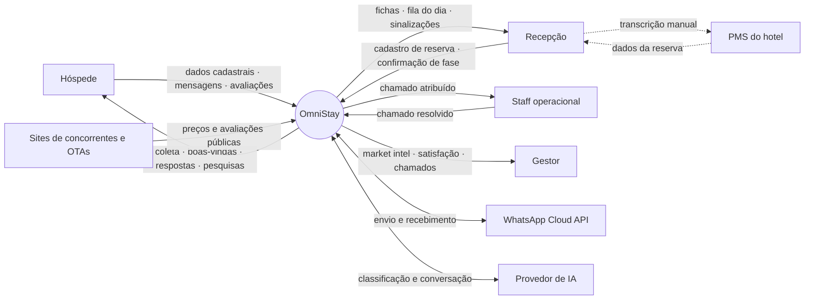
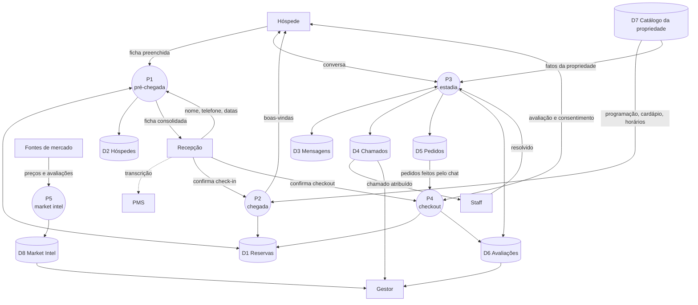
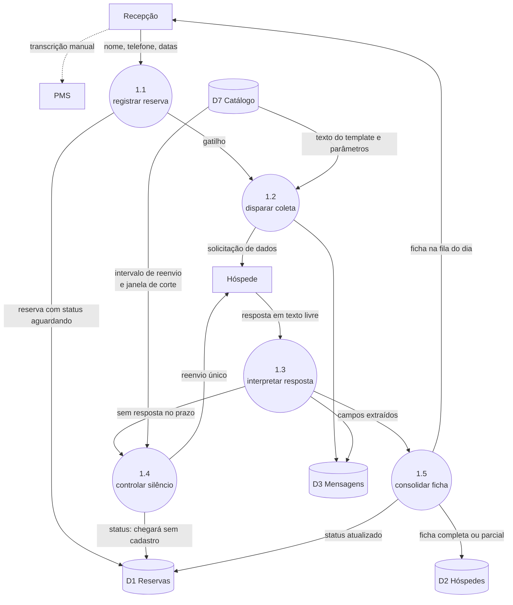
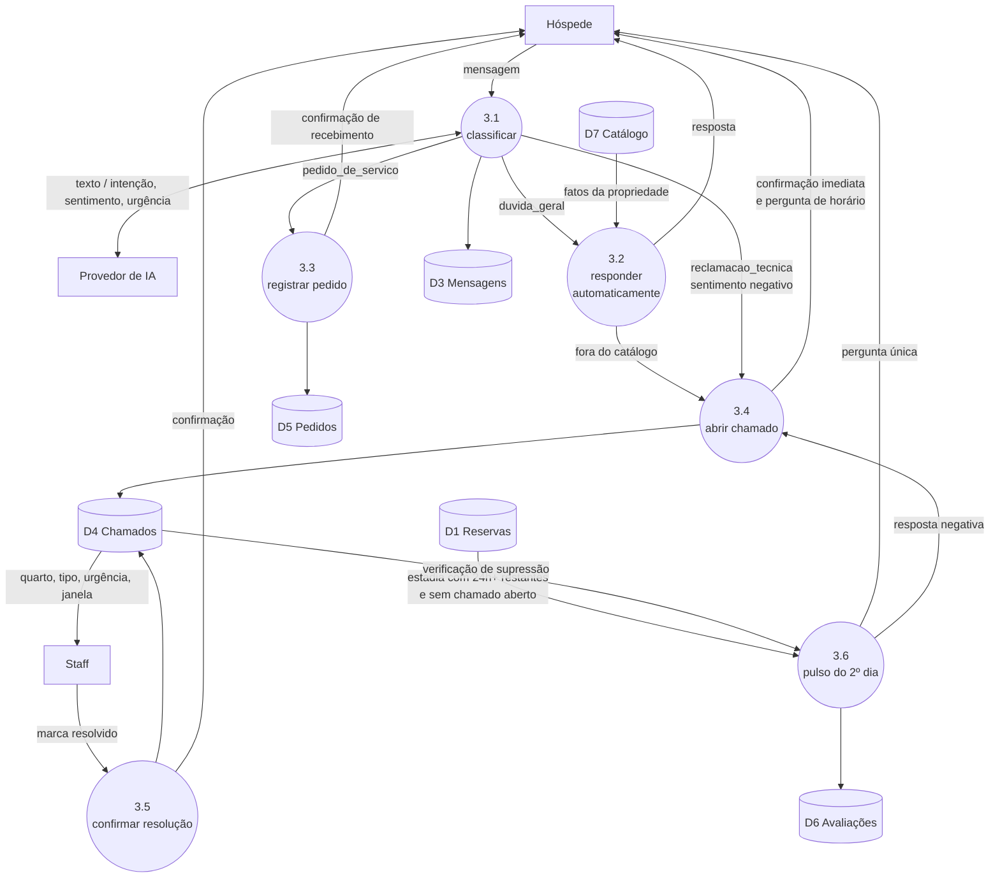

# OmniStay — Artefato 3: Fluxo de Dados e Catálogo de Eventos

**Projeto:** OmniStay — Hub Conversacional para Hotelaria
**Aluno:** Thiago Alves Feitosa — Sistemas de Informação (FIAP)
**Versão:** 1.1 — 06/08/2026
**Status:** validado

> **Histórico de alterações — v1.1 (06/08/2026).** Distinção entre serviço operacional e
> consumo faturável dentro de D5 (§4.2), e registro da **quarta travessia da fronteira
> humana** — o lançamento do consumo no PMS (§7), que havia passado despercebido na v1.0 e
> é a única das quatro cujo modo de falha tem consequência financeira.

---

## 1. Objetivo e método

Este artefato descreve **como o dado nasce, por onde passa e onde repousa** no OmniStay,
em profundidade suficiente para que a modelagem do Artefato 4 seja derivada dele em vez de
inventada do zero.

A decomposição segue três níveis, com um critério explícito de parada:

| Nível | O que mostra | Escopo |
| --- | --- | --- |
| **0 — contexto** | O sistema como caixa fechada e quem conversa com ele | Um diagrama |
| **1** | Os cinco processos, os depósitos de dados e o que passa entre eles | Um diagrama |
| **2** | O interior de um processo | **Apenas P1 e P3** |

> **Critério de parada adotado:** um nível 2 só é desenhado onde existe **bifurcação de
> decisão**. P2, P4 e P5 são sequências lineares — clique, disparo, registro — e decompô-los
> produziria diagramas de uma seta só. P1 tem três desfechos possíveis (resposta completa,
> parcial ou silêncio) e P3 tem a bifurcação entre resolução automática e escalonamento
> humano. É ali que a decomposição carrega informação.

### 1.1 Nota sobre os diagramas

Cada diagrama aparece em duas formas: o código **Mermaid**, que é a fonte editável e
renderiza direto no VS Code e no GitHub, e um **PNG exportado** na pasta `diagramas/`, para
colar no documento de entrega. As duas formas representam o mesmo desenho e **devem ser
atualizadas juntas** — o script `diagramas/gerar.py` reproduz os PNGs a partir da mesma
estrutura.

### 1.2 Convenção de notação

| Elemento | Significado | Mermaid | PNG |
| --- | --- | --- | --- |
| **Entidade externa** | Ator ou sistema fora da fronteira | Retângulo | Retângulo |
| **Processo** | Transformação de dado | Círculo / arredondado | Elipse |
| **Depósito** | Onde o dado repousa | Cilindro | Retângulo aberto |
| **Fluxo** | Dado em trânsito | Seta cheia | Seta cheia |
| **Ponte humana** | Transporte manual entre sistemas | Seta tracejada | Seta tracejada |

A **seta tracejada é a notação mais importante deste documento.** Ela marca todo ponto em
que o dado só atravessa uma fronteira porque uma pessoa o carrega — e é a representação
gráfica da premissa arquitetural do projeto.

---

## 2. Nível 0 — Diagrama de contexto

**Oito entidades externas, e uma delas é peculiar.** O PMS aparece no diagrama sem nenhuma
seta cheia ligando-o ao OmniStay. Todo o tráfego entre os dois passa pela recepção, em setas
tracejadas nas duas direções: o dado da reserva sai do PMS pelos olhos do recepcionista, e a
ficha volta para o PMS pelos dedos dele.

Vale registrar que **o WhatsApp e o provedor de IA são entidades externas, não partes do
sistema.** Ambos são serviços de terceiros com disponibilidade fora do controle do projeto —
o que torna o tratamento de falha da seção 6 uma exigência, não um refinamento.

---

## 3. Nível 1 — Processos e depósitos

### 3.1 Leitura do diagrama

Três observações que o desenho torna visíveis e que o texto sozinho escondia:

**a) D7 não existia em nenhum artefato anterior, e é obrigatório.** O P3 precisa ler os fatos
da propriedade — horário do café, cardápio, serviços, programação — e é o que delimita o que a
IA pode responder sem inventar. A pendência aberta no Artefato 2 (*"definir a base de
conhecimento que limita a resposta automática da IA"*) ganha aqui a forma de um depósito.

> **Correção (17/08/2026), na execução da F2.2.** O texto original dava dois consumidores a
> D7, P2 e P3. Na prática o P2 não lê D7: o recado de chegada é curto e usa três informações
> de entrada configuradas por propriedade, porque variável de template não aceita quebra de
> linha, tabulação nem mais de quatro espaços seguidos. **D7 tem um consumidor: o P3.** Isso
> não diminui a importância do depósito — o recado do P2 existe justamente para abrir a
> janela em que o P3 responde a partir de D7.

**b) D1 Reservas é escrito por três processos diferentes** — P1, P2 e P4 — e cada um só
altera o status. É o depósito que carrega o estado do ciclo de vida da estadia, e por isso
o mais sensível a falhas de gravação.

**c) O gestor lê três depósitos e não escreve em nenhum.** O papel dele é estritamente de
leitura, o que confirma o que o Artefato 2 registrou: o Market Intel é informativo, não
transacional. A decisão de preço acontece fora do sistema.

## 4. Depósitos de dados

Descrição em linguagem de negócio. **Atributos, tipos e chaves são deliberadamente omitidos**
— eles pertencem ao Artefato 4, e fixá-los aqui, antes da análise de normalização, criaria
dois documentos discordando sobre os mesmos campos.

| ID | Depósito | O que guarda | Escrito por | Lido por |
| --- | --- | --- | --- | --- |
| **D1** | Reservas | Uma linha por reserva: telefone de contato, datas previstas e o status do ciclo (aguardando cadastro, ficha recebida, hospedado, encerrado). É o depósito que responde "em que fase esta pessoa está" | P1, P2, P4 | P1, P2, P3, P4, painel |
| **D2** | Hóspedes | A ficha cadastral de quem já se hospedou, uma por pessoa, reaproveitável em estadias futuras. Contém o dado pessoal sensível do sistema — é o depósito que a política de retenção governa | P1 | P1, painel |
| **D3** | Mensagens | O histórico bruto da conversa em ambas as direções, com a classificação de intenção, sentimento e urgência anexada a cada mensagem recebida | P1, P2, P3, P4 | P3, painel |
| **D4** | Chamados | Ocorrências que exigiram ação humana: quarto, tipo, urgência, janela de preferência do hóspede e status de resolução | P3 | P3, staff, gestor |
| **D5** | Pedidos | Serviços solicitados pelo chat, em **duas naturezas distintas**: os que geram cobrança e os que são apenas tarefa operacional. Ver 4.2 | P3 | P4, painel, recepção |
| **D6** | Avaliações | Respostas do pulso do segundo dia e da pesquisa de checkout, com nota, comentário e o **registro de consentimento** para comunicações futuras, com data e hora | P3, P4 | P4, gestor |
| **D7** | Catálogo da propriedade | Os fatos configuráveis de cada hotel: horários, cardápio, serviços, programação, e os parâmetros operacionais (intervalo de reenvio, janela de corte). **Delimita o que a IA pode afirmar** | Configuração | P2, P3 |
| **D8** | Market Intel | Preços e avaliações públicas coletadas dos concorrentes cadastrados, com o carimbo de data da coleta | P5 | Gestor |

### 4.1 Observações sobre os depósitos

**D7 é o depósito de controle de alucinação.** Ele não é apenas conteúdo — é a fronteira do
que a resposta automática pode afirmar. Uma pergunta cuja resposta não está em D7 deve cair
no ramo humano, e não ser respondida pela IA a partir de conhecimento geral. Esse é o
mecanismo concreto que implementa a mitigação registrada na fase F3a do Artefato 2.

**D8 carrega data de coleta por exigência de uso, não de auditoria.** Preço de concorrente
sem carimbo temporal é pior do que ausência de dado, porque induz decisão errada com
aparência de fundamento. A pendência de periodicidade da coleta continua aberta.

**D2 é o único depósito sujeito à política de retenção da LGPD** em sentido estrito. D3
carrega dado pessoal por arrasto — conversas contêm o que o hóspede escreveu — e por isso
recebeu prazo próprio na recomendação do Artefato 2.

### 4.2 D5 guarda duas coisas diferentes

> **Decisão de escopo (06/08/2026):** os pedidos feitos pelo chat se dividem em duas
> naturezas com ciclos de vida distintos, e o modelo precisa distingui-las.

| Natureza | Exemplos | Ciclo de vida |
| --- | --- | --- |
| **Serviço operacional** | Toalha extra, travesseiro, cobertor | Alguém executa a tarefa. Encerra ali. Não gera cobrança e não toca o PMS |
| **Consumo faturável** | Consumo do bar, impressão de documento, lavagem de roupa | Alguém executa a tarefa **e** um funcionário lança o valor no PMS depois |

A consequência é uma **quarta travessia da fronteira humana**, tratada na seção 7. Um pedido
faturável nasce no OmniStay e precisa chegar ao PMS pelas mãos de um funcionário — mesmo
percurso da ficha de cadastro, e mesmo modo de falha.

**No checkout, apenas os faturáveis são exibidos.** A lista existe para o hóspede conferir
o que será cobrado; listar a toalha extra ao lado do consumo do bar induz a dúvida de se o
item gratuito também será cobrado.

---

## 5. Nível 2 — decomposição

### 5.1 P1 — Pré-chegada

O processo com mais caminhos de exceção do sistema. Três desfechos possíveis, e dois deles
não são o caminho feliz.

**O que a decomposição revela:**

**1.3 e 1.4 são processos distintos, não um só.** Interpretar uma resposta e controlar a
ausência dela são disparados por coisas diferentes — um por mensagem recebida, outro pela
passagem do tempo — e falham de maneiras diferentes. Tratá-los como um único processo
esconderia o fato de que 1.4 precisa de um agendador, e 1.3 não.

**1.3 é o único processo do sistema que faz extração de campos a partir de texto livre.**
O hóspede responde nove itens em uma mensagem única, e a estrutura precisa ser recuperada
dali. É onde a resposta parcial nasce: se apenas cinco campos forem reconhecidos, a ficha
segue para 1.5 marcada como parcial, sem nova rodada de mensagens — decisão registrada na
fase F1 do Artefato 2.

**1.5 escreve em dois depósitos e notifica a recepção**, mas não escreve no PMS. A última
seta do fluxo é tracejada, e é onde o dado sai do alcance do sistema.

### 5.2 P3 — Estadia

O processo com a bifurcação central do produto: o que a IA resolve sozinha e o que precisa
de gente.

**O que a decomposição revela:**

**3.2 tem uma saída para 3.4 que não é óbvia.** Quando a pergunta do hóspede não é coberta
por D7, o fluxo não responde com conhecimento geral do modelo — ele escala para o ramo
humano. Essa seta é a implementação concreta da mitigação de alucinação, e sem o nível 2 ela
não apareceria em lugar nenhum da documentação.

**3.4 tem três origens distintas:** classificação de reclamação técnica, pergunta fora do
catálogo e resposta negativa ao pulso. As três convergem no mesmo processo de abertura de
chamado, o que é desejável — há um único caminho para o Alert Center, e portanto um único
lugar onde a regra de urgência precisa estar correta.

**3.6 lê dois depósitos antes de disparar.** Precisa de D1 para saber quanto resta de
estadia e de D4 para saber se há chamado aberto. A regra de supressão decidida no Artefato 2
não é uma condição no texto da mensagem — é uma leitura de dois depósitos antes do envio,
e o diagrama torna isso explícito.

**A confirmação de recebimento aparece em 3.3 e em 3.4, antes de qualquer processamento.**
É a materialização da decisão de que o hóspede nunca fica em silêncio esperando.

---

## 6. Catálogo de eventos detalhado

Expansão das dez linhas do Artefato 1. Cada evento é descrito por cinco perguntas: o que o
dispara, que dados carrega, quem reage, o que muda no estado, e o que acontece quando falha.

A coluna de falha existe porque **duas das três dependências externas do sistema estão fora
do controle do projeto** — WhatsApp e provedor de IA. Um catálogo que descreva apenas o
caminho feliz descreve um sistema que não existe.

### 6.1 `reserva_cadastrada`

| | |
| --- | --- |
| **Gatilho** | Recepcionista salva uma reserva no painel. Manual |
| **Payload** | `id_reserva` · nome · telefone · data prevista de check-in e checkout |
| **Consumidor** | P1.2 — disparo do template de coleta |
| **Efeito no estado** | Cria linha em D1 com status `aguardando_cadastro` |
| **Se falhar** | Se o disparo do template falhar, a reserva **permanece gravada** e entra em fila de reenvio. A gravação da reserva e o envio da mensagem são operações separadas — perder a mensagem não pode significar perder a reserva |

### 6.2 `cadastro_recebido`

| | |
| --- | --- |
| **Gatilho** | Webhook do WhatsApp entrega a resposta do hóspede. Reativo |
| **Payload** | `id_reserva` (resolvido pelo telefone) · texto bruto · timestamp |
| **Consumidor** | P1.3 — interpretação e extração de campos |
| **Efeito no estado** | Grava em D3; cria ou atualiza D2; status em D1 vai para `aguardando_transcricao` ou `parcial` |
| **Se falhar** | Se a extração não reconhecer nenhum campo, **o texto bruto é preservado em D3** e a ficha é sinalizada no painel para leitura humana. Nunca se descarta a resposta do hóspede por falha de interpretação |

### 6.3 `cadastro_nao_respondido`

| | |
| --- | --- |
| **Gatilho** | Agendador verifica reservas sem resposta após o intervalo configurado em D7. Temporal |
| **Payload** | `id_reserva` · horas decorridas · indicador de reenvio já realizado |
| **Consumidor** | P1.4 — controle de silêncio |
| **Efeito no estado** | Primeiro disparo: envia reenvio único. Segundo: status em D1 vai para `chegara_sem_cadastro` |
| **Se falhar** | Se o agendador não rodar, a reserva simplesmente chega sem cadastro — **degradação segura**, que é o comportamento já previsto no fluxo tradicional. Nenhuma ação corretiva urgente é necessária |

### 6.4 `checkin_confirmado`

| | |
| --- | --- |
| **Gatilho** | Recepcionista clica em confirmar check-in. Manual |
| **Payload** | `id_reserva` · `id_hospede` · timestamp |
| **Consumidor** | P2 — recado curto de boas-vindas |
| **Efeito no estado** | Status em D1 vai para `hospedado`; abre a janela de atendimento de 24h |
| **Se falhar** | **É o ponto único de falha mais crítico do sistema, e falha em silêncio.** Se o clique não acontecer, nada é disparado e nenhum erro é gerado. Mitigações no Artefato 2 §9.1: detecção de divergência temporal, inferência por mensagem recebida de hóspede não confirmado, e confirmação em lote |

> **Correção (17/08/2026), na execução da F2.2.** O recado de chegada **não** carrega o
> conteúdo de D7. Ele leva três informações de entrada configuradas por propriedade (café,
> wi-fi, checkout) e convida o hóspede a perguntar; D7 é lido depois, no P3, para responder na
> janela de 24h. Motivo: variável de template recusa quebra de linha, tabulação e mais de
> quatro espaços seguidos. A aresta `D7 → P2` do diagrama de nível 1 (e o PNG correspondente)
> descreve a intenção original e permanece como registro; o consumidor real de D7 é o P3.

### 6.5 `mensagem_recebida`

| | |
| --- | --- |
| **Gatilho** | Webhook do WhatsApp entrega mensagem de hóspede hospedado. Reativo |
| **Payload** | `id_estadia` · texto · timestamp · tipo de mídia |
| **Consumidor** | P3.1 — classificação |
| **Efeito no estado** | Grava em D3; anexa classificação de intenção, sentimento e urgência |
| **Se falhar** | **Se o provedor de IA estiver indisponível, a mensagem não pode ser perdida.** Ela é gravada em D3 sem classificação e escalada para o ramo humano por padrão. A regra é: na dúvida, um humano vê — nunca o contrário |

### 6.6 `chamado_aberto`

| | |
| --- | --- |
| **Gatilho** | Classificação de reclamação técnica, pergunta fora do catálogo D7, ou resposta negativa ao pulso. Reativo |
| **Payload** | `id_estadia` · quarto · tipo · urgência · janela de preferência do hóspede |
| **Consumidor** | P3.4 e o Alert Center |
| **Efeito no estado** | Cria linha em D4 com status `aberto` |
| **Se falhar** | Se a notificação ao staff falhar, **o chamado permanece em D4 e aparece no painel** — a notificação é conveniência, a fila é a fonte da verdade. O painel do início de turno (R1) recupera qualquer chamado cuja notificação tenha se perdido |

### 6.7 `chamado_resolvido`

| | |
| --- | --- |
| **Gatilho** | Staff marca como resolvido no Alert Center. Manual |
| **Payload** | `id_chamado` · timestamp · quem resolveu |
| **Consumidor** | P3.5 — confirmação ao hóspede |
| **Efeito no estado** | Status em D4 vai para `resolvido` |
| **Se falhar** | Se o staff resolver fisicamente e não marcar, **o hóspede nunca recebe confirmação** e o chamado envelhece aberto no painel. Mitigação: destaque de chamados abertos há tempo demais na tela de passagem de turno (R7) |

### 6.8 `pulso_segundo_dia`

| | |
| --- | --- |
| **Gatilho** | Agendador, no segundo dia de estadia. Temporal, **com dupla supressão** |
| **Payload** | `id_estadia` · horas restantes de estadia · existência de chamado aberto |
| **Consumidor** | P3.6 |
| **Efeito no estado** | Grava resposta em D6; resposta negativa gera chamado em D4 |
| **Se falhar** | Não dispara. **Perda tolerável** — o pulso é instrumento de recuperação, e sua ausência não quebra nenhum fluxo. Não deve haver reenvio automático, sob risco de disparar fora da janela útil |

### 6.9 `checkout_realizado`

| | |
| --- | --- |
| **Gatilho** | Recepcionista confirma o checkout no painel. Manual |
| **Payload** | `id_estadia` · timestamp |
| **Consumidor** | P4 — pesquisa de avaliação |
| **Efeito no estado** | Status em D1 vai para `encerrado`; consolida D5 para exibição |
| **Se falhar** | Mesmo padrão silencioso do 6.4: sem o clique, a pesquisa não sai e **ninguém reclama de uma pesquisa que não chegou.** Mitigação: divergência entre data prevista de checkout e status ainda `hospedado` sinalizada no painel |

### 6.10 `coleta_mercado`

| | |
| --- | --- |
| **Gatilho** | Agendador, na periodicidade configurada. Agendado |
| **Payload** | Lista de concorrentes cadastrados · timestamp da execução |
| **Consumidor** | P5 |
| **Efeito no estado** | Grava em D8 com carimbo de data |
| **Se falhar** | Registra a falha e **mantém o dado anterior com o carimbo antigo visível**. Preço de concorrente exibido sem indicação de quando foi coletado é pior do que ausência de dado, porque induz decisão errada com aparência de fundamento |

### 6.11 Padrões de falha identificados

O catálogo, lido em conjunto, revela três padrões recorrentes que valem como regras gerais
para o Artefato 5:

| Padrão | Regra |
| --- | --- |
| **Gravar antes de enviar** | Nenhuma falha de envio de mensagem pode causar perda de dado. Persistência e comunicação são operações separadas |
| **Na dúvida, escala para humano** | Falha de classificação, texto não reconhecido ou pergunta fora do catálogo terminam sempre em fila humana, nunca em resposta automática arriscada |
| **A fila é a fonte da verdade, a notificação é conveniência** | Todo alerta perdido precisa ser recuperável pela leitura do painel |

---

## 7. A fronteira humana

O aspecto mais incomum deste DFD, e o que exige explicação em banca.

Um diagrama de fluxo de dados convencional mostra sistemas trocando dados diretamente. Aqui,
**quatro travessias de fronteira acontecem por transporte humano**, e estão marcadas com
seta tracejada:

| # | Travessia | Quem transporta | O que atravessa | Se falhar |
| --- | --- | --- | --- | --- |
| 1 | PMS → OmniStay | Recepcionista | Dados da reserva: nome, telefone, datas | A reserva não existe no sistema. Nenhuma mensagem é enviada |
| 2 | OmniStay → PMS | Recepcionista | Ficha cadastral consolidada | O hóspede não consta no PMS. Erro visível no balcão |
| 3 | Mundo físico → OmniStay | Recepcionista | O fato de que o hóspede chegou ou partiu | Falha silenciosa — o sistema segue achando que nada aconteceu |
| 4 | OmniStay → PMS | Recepcionista | **Consumo faturável pedido pelo chat** | **Falha silenciosa com prejuízo financeiro** — o hotel entrega o serviço e não cobra |

A terceira é a menos óbvia. **O OmniStay não tem nenhum sensor da realidade física.** Ele
não sabe que a Marina chegou; ele sabe que alguém clicou em um botão afirmando que ela
chegou. Toda a fase P2 depende dessa afirmação humana ser verdadeira e pontual.

**A quarta é a de maior consequência**, e foi identificada tarde na análise. Um consumo
pedido pelo chat — bar, impressão, lavanderia — é executado pela operação e precisa ser
lançado no PMS por um funcionário para virar cobrança. Se esse lançamento não acontece,
**o hotel presta o serviço de graça, e ninguém percebe**: o hóspede não reclama de um item
que não foi cobrado, e o sistema não tem como saber o que o PMS faturou.

> **Mitigação proposta:** todo consumo faturável nasce com status `pendente_de_lancamento` e
> **só sai da fila do painel quando alguém o marca como lançado**. A fila de pendências de
> lançamento aparece na tela de passagem de turno, ao lado dos chamados abertos. É o mesmo
> padrão das outras mitigações: não elimina a dependência humana, mas torna a omissão
> visível em vez de silenciosa.

Isso não é uma falha de projeto — é a consequência aceita de não integrar ao PMS, e a
contrapartida é o argumento comercial de adoção sem troca de sistema. Mas precisa estar
**documentado como decisão consciente**, e não descoberto pela banca.

### 7.1 O que mudaria com integração

Registro para a defesa, porque a pergunta virá:

| Aspecto | Sem integração (atual) | Com integração (evolução futura) |
| --- | --- | --- |
| Travessias 1 e 2 | Digitação manual nas duas direções | Sincronização automática |
| Travessia 3 | Clique no painel | Evento do PMS |
| Travessia 4 | Lançamento manual do consumo | Débito automático na conta |
| Ponto único de falha | Quatro pontos manuais | Eliminado |
| Atrito de venda | Praticamente zero | Alto — exige projeto de integração por propriedade |
| Lista de pedidos no checkout | Só o que passou pelo chat | Conta completa |

A coluna da direita é o roadmap. A da esquerda é o que torna o produto vendável hoje.

---

## 8. Questões encaminhadas ao Artefato 5

Pontos que o fluxo de dados expôs mas que são decisões de arquitetura, não de análise.
Registrados aqui para não se perderem.

**a) Idempotência dos webhooks.** O WhatsApp reenvia notificações quando não recebe
confirmação de processamento. O mesmo `mensagem_recebida` pode chegar duas ou três vezes.
Sem tratamento, o hóspede recebe respostas duplicadas e D3 acumula linhas repetidas.
A solução usual é registrar o identificador da mensagem e descartar repetições — mas a
escolha do mecanismo é do Artefato 5.

**b) Ordem de chegada.** Duas mensagens enviadas em sequência pelo hóspede podem ser
entregues fora de ordem. Para classificação isso é irrelevante; para uma conversa com
contexto, não é.

**c) O agendador.** Três eventos são temporais — `cadastro_nao_respondido`,
`pulso_segundo_dia` e `coleta_mercado`. Todos precisam de um mecanismo de agendamento
confiável, e nenhum artefato definiu ainda qual.

**d) Onde vive D7.** O catálogo da propriedade é configuração, conteúdo ou base vetorial
para busca semântica? A resposta muda a arquitetura da resposta automática e é a decisão
técnica mais consequente ainda em aberto.

## 9. Pendências abertas

Herdadas:

- [ ] Intervalo do reenvio e janela de corte na pré-chegada — **parâmetros de D7**
- [ ] Política de retenção e prazo de exclusão — incide sobre **D2 e D3**
- [ ] Lista de concorrentes e periodicidade da coleta — **parâmetros de D8**
- [ ] Confirmar a lista oficial de campos exigidos por lei para registro de hóspede
- [ ] Testar colagem no PMS real
- [ ] Mecanismo de acesso do staff ao Alert Center pelo celular
- [ ] Confirmar a categoria do template de pulso junto à Meta
- [ ] Redigir a pergunta de opt-in da pesquisa de checkout
- [ ] Material do MVP de usuário, ainda não enviado

Levantadas por este artefato:

- [ ] **Definir o conteúdo e a estrutura de D7** — é o depósito que delimita o que a IA pode
      afirmar, e nenhum artefato descreveu ainda o que ele contém
- [ ] Definir os status possíveis de D1 e as transições válidas entre eles — vira máquina de
      estados no Artefato 4
- [x] ~~Decidir se D5 Pedidos registra valor monetário~~ Resolvido: registra para consumo
      faturável, com preço praticado no momento; serviço operacional não tem valor (§4.2)

---

## Próximos artefatos

| # | Artefato | O que este documento entrega a ele |
| --- | --- | --- |
| 4 | Modelagem de dados (DER + dicionário) | Oito depósitos nomeados e descritos, os payloads de dez eventos, e a lista de status de D1 a formalizar |
| 5 | Arquitetura e stack | As quatro questões da seção 8, os três padrões de falha da 6.11 e as dependências externas do nível 0 |
| 6 | Business Model Canvas — revisão completa | A tabela 7.1, que separa o que o produto entrega hoje do que dependeria de integração |
