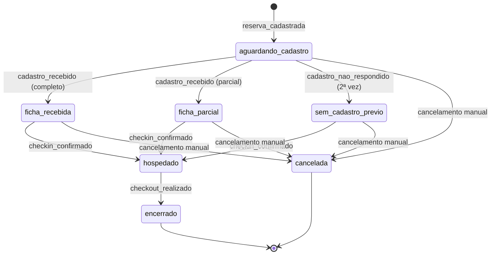
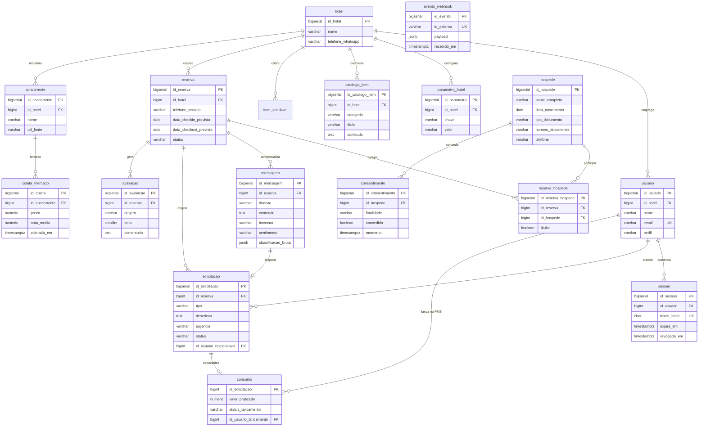

# OmniStay — Artefato 4: Modelagem de Dados

**Projeto:** OmniStay — Hub Conversacional para Hotelaria
**Aluno:** Thiago Alves Feitosa — Sistemas de Informação (FIAP)
**Versão:** 1.0 — 06/08/2026
**Status:** em elaboração

---

## 1. Objetivo e critérios

Este artefato transforma os oito depósitos do Artefato 3 em um modelo relacional
implementável: entidades, relacionamentos, atributos, restrições e o script de criação.

**Critérios de projeto adotados:**

| Critério | Decisão |
| --- | --- |
| Forma normal alvo | **3FN**, com desnormalização apenas onde justificada por escrito |
| Notação do diagrama | **Pé de galinha (crow's foot)** — cardinalidade legível e padrão de ferramentas |
| SGBD | PostgreSQL, com `JSONB` para payloads de webhook e saídas de NLP |
| Chaves primárias | Substitutas (`BIGSERIAL`), com chaves naturais protegidas por `UNIQUE` |
| Exclusão | Nenhuma entidade com dado histórico usa exclusão física |
| Dado pessoal | Classificado campo a campo, com prazo de retenção declarado |

> **Decisão de escopo (06/08/2026):** este artefato entrega **apenas o modelo relacional**.
> Modelagem dimensional (esquema estrela) não faz parte do MVP e não recebe seção neste
> documento. Justificativa: o sistema é transacional, e o volume da propriedade de
> referência — cerca de 6 mil estadias por ano — é agregável por consulta direta no
> PostgreSQL. Construir um data warehouse para esse volume seria engenharia sem problema
> correspondente.

### 1.1 Do depósito à tabela

Um depósito do DFD é um conceito lógico; uma tabela é uma estrutura física. **A relação
entre eles não é de um para um**, e as divergências estão registradas aqui:

| Depósito (Art. 3) | Tabelas | Observação |
| --- | --- | --- |
| D1 Reservas | `reserva`, `reserva_hospede` | Uma reserva pode ter vários hóspedes |
| D2 Hóspedes | `hospede`, `consentimento` | Consentimento tem histórico próprio |
| D3 Mensagens | `mensagem` | Classificação como atributos + `JSONB` bruto |
| D4 Chamados **e** D5 Pedidos | `solicitacao`, `consumo` | **Depósitos distintos, tabela comum** |
| D6 Avaliações | `avaliacao` | |
| D7 Catálogo | `catalogo_item`, `parametro_hotel` | Conteúdo e configuração se separam |
| D8 Market Intel | `concorrente`, `coleta_mercado` | Cadastro e série temporal |

**A fusão de D4 e D5 é a decisão mais consequente deste artefato** e está justificada
na seção 3.

---

## 2. Modelo conceitual

Quinze entidades, agrupadas por área funcional.

| Área | Entidades |
| --- | --- |
| **Propriedade** | `hotel` · `usuario` · `parametro_hotel` · `catalogo_item` |
| **Hospedagem** | `hospede` · `reserva` · `reserva_hospede` · `consentimento` |
| **Conversa** | `mensagem` · `evento_webhook` |
| **Atendimento** | `solicitacao` · `consumo` |
| **Feedback** | `avaliacao` |
| **Mercado** | `concorrente` · `coleta_mercado` |

### 2.1 Por que `hotel` existe desde o MVP

O OmniStay é um produto B2B2C — a proposta é vender para várias propriedades. Introduzir
o particionamento por hotel depois de o sistema estar em uso é uma migração que toca toda
tabela e toda consulta.

> **Decisão (06/08/2026):** `id_hotel` está presente desde a primeira versão do esquema nas
> tabelas de domínio da propriedade. O MVP opera com uma única linha em `hotel`, mas a
> estrutura não precisará ser reescrita para comportar a segunda.

Esse é o tipo de decisão barata agora e cara depois — o custo hoje é uma coluna e um índice.

---

## 3. A decisão central: `solicitacao` e `consumo`

O Artefato 3 tratava chamados (D4) e pedidos (D5) como depósitos separados, e o usuário
identificou que os pedidos, por sua vez, se dividem em duas naturezas. Havia então três
candidatos a entidade:

| Candidato | Origem | Exemplo |
| --- | --- | --- |
| Reclamação técnica | `reclamacao_tecnica` com sentimento negativo | Ar-condicionado não gela |
| Serviço operacional | `pedido_de_servico` sem item vendável único | Toalha extra, travesseiro |
| Consumo faturável | `pedido_de_servico` identificado em item ativo | Bar, impressão, lavanderia |

### 3.1 Análise

Comparando os atributos que cada um exige:

| Atributo | Reclamação | Serviço | Consumo |
| --- | --- | --- | --- |
| Estadia, quarto, descrição | ✔ | ✔ | ✔ |
| Status, responsável, timestamps | ✔ | ✔ | ✔ |
| Urgência, janela de preferência | ✔ | ✔ | ✔ |
| Valor e status de lançamento no PMS | — | — | ✔ |

Os três compartilham tudo, exceto o faturamento. **São a mesma coisa do ponto de vista
operacional** — "alguém precisa fazer algo no quarto 402" — e diferem apenas na origem e,
em um dos casos, na existência de cobrança.

### 3.2 Decisão

> **Decisão de modelagem (06/08/2026):** uma tabela `solicitacao` guarda os atributos
> comuns, discriminada por `tipo` (`reclamacao`, `servico`, `consumo`). O subtipo faturável
> ganha uma tabela filha `consumo`, em relacionamento **1:0..1**, com valor e status de
> lançamento no PMS.
>
> Justificativas:
>
> - **Três tabelas quase idênticas violariam o princípio da entidade única** e obrigariam o
>   Alert Center a consultar três fontes para montar uma fila só.
> - **Um campo `valor` nulável em 80% das linhas** é o padrão que rende pergunta de
>   normalização em banca, e com razão: o valor não é atributo da solicitação em geral, é
>   atributo de um subtipo dela.
> - A especialização em tabela filha mantém `NOT NULL` no valor, onde ele realmente existe.

Este é o padrão de **especialização parcial e exclusiva**: nem toda solicitação é consumo,
e uma solicitação que seja consumo não é outra coisa.

### 3.3 Consequência para o checkout

`consumo` é a única fonte da lista apresentada no checkout. Uma solicitação de tipo
`servico` nunca aparece ali — decisão do Artefato 3 §4.2.

---

## 4. Máquina de estados de `reserva`

O Artefato 3 deixou como pendência definir os status válidos de D1 e as transições
permitidas. Sem isso, o campo `status` vira texto livre e o sistema aceita qualquer coisa.

| De | Para | Disparado por |
| --- | --- | --- |
| *(inicial)* | `aguardando_cadastro` | `reserva_cadastrada` |
| `aguardando_cadastro` | `ficha_recebida` | `cadastro_recebido`, todos os campos reconhecidos |
| `aguardando_cadastro` | `ficha_parcial` | `cadastro_recebido`, campos incompletos |
| `aguardando_cadastro` | `sem_cadastro_previo` | `cadastro_nao_respondido` no segundo disparo |
| `ficha_recebida`, `ficha_parcial`, `sem_cadastro_previo` | `hospedado` | `checkin_confirmado` |
| `hospedado` | `encerrado` | `checkout_realizado` |
| Qualquer estado anterior a `hospedado` | `cancelada` | Ação manual da recepção |

**Regras que a máquina de estados impõe:**

1. **Não se faz checkout de quem não fez check-in.** `encerrado` só é alcançável a partir de
   `hospedado` — o que resolve, no nível do dado, parte do risco do clique esquecido.
2. **Não se cancela reserva de hóspede já hospedado.** Depois do check-in, o caminho é o
   checkout, não o cancelamento.
3. **`ficha_parcial` não bloqueia o check-in.** É sinalização para a recepção, não
   impedimento — coerente com a decisão de que o cadastro degrada para o balcão.

> **Implementação:** a restrição é aplicada por `CHECK` no domínio do campo e por trigger de
> validação de transição. Deixar isso apenas na camada de aplicação significa que qualquer
> script de correção ou importação pode corromper o histórico.

---

## 5. Diagrama entidade-relacionamento

### 5.1 Relacionamentos que merecem explicação

**`reserva` para `reserva_hospede` é 1:N obrigatório.** Toda reserva tem ao menos um hóspede
— o titular. É a materialização da decisão do Artefato 2 de que a ficha por WhatsApp é a do
titular, mas a estrutura comporta acompanhantes desde já. Trocar isso depois seria migração
de esquema, não ajuste de tela.

**Na criação da reserva (F1.1), o titular nasce provisório:** a recepção informa nome e
telefone; o sistema grava um `hospede` com apenas `nome_completo` e `telefone`, e o vínculo
em `reserva_hospede` com `titular = true` e `ficha_completa = false`. A ficha completa
(documento, endereço etc.) chega depois, na interpretação da resposta do hóspede. Telefone
repetido **sempre** cria um hóspede novo — o número pode ser de duas pessoas (casal, telefone
de empresa). Se um dia existir histórico “por pessoa”, a consolidação será um passo explícito,
nunca reaproveitamento silencioso pelo número.

**`mensagem` para `solicitacao` é 1:0..1 opcional.** A maioria das mensagens não gera
solicitação nenhuma. Quando gera, guardar a origem permite auditar por que um chamado foi
aberto — informação necessária quando a classificação da IA errar.

**`solicitacao` para `consumo` é 1:0..1**, e a chave primária de `consumo` é a mesma de
`solicitacao`. Isso é o padrão de especialização: não há `id_consumo` próprio, porque um
consumo *é* uma solicitação, não algo que pertence a uma.

**`consentimento` é 1:N a partir de `hospede`, e não um campo booleano.** Consentimento pode
ser concedido e depois revogado, e a LGPD exige poder demonstrar **qual era o estado em cada
momento**. Um campo `aceita_marketing BOOLEAN` responde "aceita hoje?" mas não responde
"aceitava em março?" — que é a pergunta de uma eventual fiscalização.

**`evento_webhook` não se relaciona com nada.** É uma tabela de controle de idempotência:
guarda o identificador externo de cada notificação já processada, para descartar reenvios do
WhatsApp. A questão foi levantada na seção 8 do Artefato 3 e resolvida aqui no nível do dado.

### 5.2 O que deliberadamente **não** foi modelado

| Ausência | Por quê |
| --- | --- |
| `idade` | Derivada de `data_nascimento`. Materializá-la introduz inconsistência no dia seguinte a cada aniversário. Decisão fechada no Artefato 1 |
| Tabela `quarto` | O número do quarto vive no PMS. O OmniStay o recebe como texto na solicitação, e não gerencia inventário de quartos |
| Tabela de fatura ou conta | A conta é do PMS. `consumo` registra o que passou pelo chat, nada além |
| Foto do documento | Decisão de minimização de dados do Artefato 1 |
| FK de `consumo` para preço vigente | `item_vendavel` existe (F3.7) como fonte do preço **atual**. `consumo.valor_praticado` é retrato; ligar os dois reescreveria o histórico a cada reajuste |

A última merece ênfase: **`valor_praticado` é um dado histórico, não uma referência.** Se o
hotel reajusta a diária da lavanderia em setembro, o consumo de agosto precisa continuar
mostrando o valor de agosto.

---

## 6. Dicionário de dados

### 6.1 Classificação de dados pessoais

Cada campo recebe uma classificação, e cada classificação tem um prazo de retenção. Esta é
a seção que fecha a pendência de LGPD arrastada desde o Artefato 1.

| Classe | Significado | Retenção |
| --- | --- | --- |
| **DP** | Dado pessoal — identifica ou torna identificável uma pessoa natural | 5 anos após o checkout |
| **DPS** | Dado pessoal sensível ou de identificação forte, exigindo cautela adicional | 5 anos após o checkout |
| **DPC** | Dado pessoal em conteúdo livre — o titular pode ter escrito qualquer coisa | 12 meses após o checkout |
| **OP** | Dado operacional, sem vínculo pessoal | Indefinido |

> **Decisão de retenção (06/08/2026):** ficha cadastral por **5 anos** após o checkout,
> alinhada ao prazo de guarda do registro de hóspedes da legislação de turismo e ao prazo
> prescricional civil; **histórico de conversas por 12 meses**, por ser dado operacional sem
> exigência legal de guarda longa e por carregar conteúdo livre imprevisível; **expurgo
> automático agendado**, nunca manual.
>
> Justificativa do prazo menor para conversas: o hóspede pode escrever qualquer coisa em uma
> mensagem — dado de saúde, informação de terceiros, opinião. Como o conteúdo não é
> controlável, o prazo compensa reduzindo a janela de exposição.

### 6.2 Tabelas de propriedade

**`hotel`**

| Campo | Tipo | Restrições | Classe | Descrição |
| --- | --- | --- | --- | --- |
| `id_hotel` | `BIGSERIAL` | PK | OP | Identificador |
| `nome` | `VARCHAR(120)` | NOT NULL | OP | Nome da propriedade |
| `telefone_whatsapp` | `VARCHAR(20)` | NOT NULL | OP | Número da conta WhatsApp Business |
| `criado_em` | `TIMESTAMPTZ` | NOT NULL, default `now()` | OP | |

**`usuario`** — recepção, staff e gestão

| Campo | Tipo | Restrições | Classe | Descrição |
| --- | --- | --- | --- | --- |
| `id_usuario` | `BIGSERIAL` | PK | OP | |
| `id_hotel` | `BIGINT` | FK, NOT NULL | OP | |
| `nome` | `VARCHAR(120)` | NOT NULL | DP | Nome do funcionário |
| `email` | `VARCHAR(160)` | NOT NULL, UNIQUE | DP | Login |
| `senha_hash` | `VARCHAR(255)` | NOT NULL | DPS | Hash, **nunca a senha** |
| `perfil` | `VARCHAR(20)` | NOT NULL, CHECK | OP | `recepcao`, `staff`, `gestor` |
| `ativo` | `BOOLEAN` | NOT NULL, default `true` | OP | Desativação lógica |

**`sessao`** — sessão do painel, uma linha por dispositivo autenticado

| Campo | Tipo | Restrições | Classe | Descrição |
| --- | --- | --- | --- | --- |
| `id_sessao` | `BIGSERIAL` | PK | OP | |
| `id_usuario` | `BIGINT` | FK, NOT NULL | OP | O hotel da sessão vem do usuário, por junção |
| `token_hash` | `CHAR(64)` | NOT NULL, UNIQUE | Credencial | SHA-256 do token opaco; o token existe só no cookie |
| `dispositivo` | `VARCHAR(120)` | | DP | Rótulo informado no login ou agente do cliente |
| `criada_em` | `TIMESTAMPTZ` | NOT NULL, default `now()` | OP | |
| `expira_em` | `TIMESTAMPTZ` | NOT NULL, CHECK `> criada_em` | OP | Fixado na criação a partir da duração do perfil |
| `revogada_em` | `TIMESTAMPTZ` | CHECK `>= criada_em` se preenchido | OP | Nulo enquanto ativa |

**`parametro_hotel`** — configuração operacional por propriedade

| Campo | Tipo | Restrições | Classe | Descrição |
| --- | --- | --- | --- | --- |
| `id_parametro` | `BIGSERIAL` | PK | OP | |
| `id_hotel` | `BIGINT` | FK, NOT NULL | OP | |
| `chave` | `VARCHAR(60)` | NOT NULL, UNIQUE com `id_hotel` | OP | Ver lista abaixo |
| `valor` | `VARCHAR(255)` | NOT NULL | OP | |

Chaves previstas: `horas_ate_reenvio` · `horas_corte_antes_checkin` ·
`periodicidade_coleta_mercado` · `horas_minimas_para_pulso` ·
`duracao_sessao_recepcao_horas` · `duracao_sessao_staff_horas` ·
`duracao_sessao_gestor_horas` · `contato_responsavel_dados` ·
`tentativas_max_envio_mensagem` · `horas_validade_boas_vindas` ·
`horas_destaque_chamado_aberto`.

A F1.4 **usa** os dois prazos de silêncio: o bootstrap (e a revisão `0007`) semeia
`horas_ate_reenvio=24` e `horas_corte_antes_checkin=12`. Ausência da chave na verificação
não assume esses números em código.

**Isto resolve três pendências abertas de uma vez.** Os parâmetros que estavam "a definir"
desde o Artefato 1 deixam de ser constantes no código e passam a ser configuração por
propriedade — que era o requisito original.

**`catalogo_item`** — os fatos da propriedade que delimitam a resposta da IA

| Campo | Tipo | Restrições | Classe | Descrição |
| --- | --- | --- | --- | --- |
| `id_catalogo_item` | `BIGSERIAL` | PK | OP | |
| `id_hotel` | `BIGINT` | FK, NOT NULL | OP | |
| `categoria` | `VARCHAR(40)` | NOT NULL, CHECK | OP | `horario`, `cardapio`, `servico`, `programacao`, `regra` |
| `titulo` | `VARCHAR(160)` | NOT NULL | OP | Ex.: "Horário do café da manhã" |
| `conteudo` | `TEXT` | NOT NULL | OP | O fato em si |
| `ativo` | `BOOLEAN` | NOT NULL, default `true` | OP | |

> **Esta tabela é o limite do que a IA pode afirmar.** Uma pergunta cuja resposta não esteja
> aqui não é respondida com conhecimento geral do modelo — escala para o ramo humano,
> conforme a decisão registrada na fase F3a do Artefato 2 e o fluxo 3.2 → 3.4 do Artefato 3.
> A pendência da "base de conhecimento da propriedade" fecha aqui.

### 6.3 Tabelas de hospedagem

**`hospede`** — a tabela de maior sensibilidade do sistema

| Campo | Tipo | Restrições | Classe | Descrição |
| --- | --- | --- | --- | --- |
| `id_hospede` | `BIGSERIAL` | PK | OP | |
| `nome_completo` | `VARCHAR(160)` | NOT NULL | DP | |
| `profissao` | `VARCHAR(80)` | | DP | |
| `data_nascimento` | `DATE` | | DP | **Idade é derivada daqui, nunca armazenada** |
| `tipo_documento` | `VARCHAR(20)` | CHECK | DP | `rg`, `cpf`, `passaporte` |
| `numero_documento` | `VARCHAR(40)` | | DPS | |
| `endereco` | `VARCHAR(200)` | | DP | |
| `cep` | `VARCHAR(9)` | | DP | |
| `cidade` | `VARCHAR(80)` | | DP | |
| `telefone` | `VARCHAR(20)` | NOT NULL | DP | Chave de correlação com o WhatsApp |
| `criado_em` | `TIMESTAMPTZ` | NOT NULL, default `now()` | OP | Base da contagem de retenção |

`tipo_documento` e `numero_documento` são **dois campos e não um** para acomodar RG, CPF e
passaporte sem quebrar o cadastro de estrangeiros — decisão do Artefato 1. A combinação dos
dois recebe índice único parcial, ignorando nulos.

**`reserva`**

| Campo | Tipo | Restrições | Classe | Descrição |
| --- | --- | --- | --- | --- |
| `id_reserva` | `BIGSERIAL` | PK | OP | |
| `id_hotel` | `BIGINT` | FK, NOT NULL | OP | |
| `telefone_contato` | `VARCHAR(20)` | NOT NULL | DP | Digitado pela recepção. É a chave de roteamento das mensagens |
| `data_checkin_prevista` | `DATE` | NOT NULL | OP | |
| `data_checkout_prevista` | `DATE` | NOT NULL, CHECK > checkin | OP | |
| `status` | `VARCHAR(30)` | NOT NULL, CHECK | OP | Domínio da máquina de estados da seção 4 |
| `reenvio_realizado` | `BOOLEAN` | NOT NULL, default `false` | OP | Garante o reenvio **único**. A F1.4 grava `true` na mesma transação que enfileira o lembrete. |
| `checkin_em` | `TIMESTAMPTZ` | | OP | Momento real, não previsto |
| `checkout_em` | `TIMESTAMPTZ` | | OP | Momento real |

`telefone_contato` fica na reserva, e não apenas no hóspede, porque **ele é digitado antes de
o hóspede existir no sistema.** Na criação da reserva ainda não há ficha — só um número.

**`reserva_hospede`** — associativa

| Campo | Tipo | Restrições | Classe | Descrição |
| --- | --- | --- | --- | --- |
| `id_reserva_hospede` | `BIGSERIAL` | PK | OP | |
| `id_reserva` | `BIGINT` | FK, NOT NULL | OP | |
| `id_hospede` | `BIGINT` | FK, NOT NULL | OP | |
| `titular` | `BOOLEAN` | NOT NULL, default `false` | OP | Apenas um por reserva |
| `ficha_completa` | `BOOLEAN` | NOT NULL, default `false` | OP | Distingue ficha parcial |

A unicidade do titular é garantida por índice único parcial — `WHERE titular = true`.

**`consentimento`**

| Campo | Tipo | Restrições | Classe | Descrição |
| --- | --- | --- | --- | --- |
| `id_consentimento` | `BIGSERIAL` | PK | OP | |
| `id_hospede` | `BIGINT` | FK, NOT NULL | OP | |
| `finalidade` | `VARCHAR(40)` | NOT NULL, CHECK | OP | `comunicacao_marketing` no MVP |
| `concedido` | `BOOLEAN` | NOT NULL | OP | `false` registra a **revogação** |
| `momento` | `TIMESTAMPTZ` | NOT NULL, default `now()` | OP | |
| `origem` | `VARCHAR(40)` | NOT NULL | OP | `pesquisa_checkout` no MVP |

**Nunca se atualiza uma linha desta tabela — insere-se outra.** O estado atual é a linha mais
recente por hóspede e finalidade. É o que permite responder "qual era o consentimento em
março?", pergunta que um campo booleano não responde.

### 6.4 Tabelas de conversa

**`mensagem`**

| Campo | Tipo | Restrições | Classe | Descrição |
| --- | --- | --- | --- | --- |
| `id_mensagem` | `BIGSERIAL` | PK | OP | |
| `id_reserva` | `BIGINT` | FK, NOT NULL | OP | |
| `direcao` | `VARCHAR(10)` | NOT NULL, CHECK | OP | `recebida`, `enviada` |
| `conteudo` | `TEXT` | NOT NULL | **DPC** | Conteúdo livre — retenção de 12 meses |
| `enviada_em` | `TIMESTAMPTZ` | NOT NULL, default `now()` | OP | |
| `id_externo` | `VARCHAR(80)` | | OP | Identificador do WhatsApp |
| `intencao` | `VARCHAR(40)` | CHECK | OP | Taxonomia do Artefato 1 |
| `sentimento` | `VARCHAR(20)` | CHECK | OP | `positivo`, `neutro`, `negativo` |
| `urgencia` | `VARCHAR(20)` | CHECK | OP | `baixa`, `media`, `alta` |
| `classificacao_bruta` | `JSONB` | | OP | Saída completa do modelo, para auditoria |
| `status_envio` | `VARCHAR(20)` | CHECK | OP | `pendente`, `enviada`, `entregue`, `falha` |

`status_envio` implementa a sinalização de falha de entrega proposta na etapa R2 do
Artefato 2 — é como o telefone digitado errado se torna visível no painel.

`classificacao_bruta` em `JSONB` guarda a resposta completa do modelo enquanto os campos
estruturados guardam o que o sistema consome. Quando a classificação errar, é essa coluna
que permite entender por quê.

**`evento_webhook`** — controle de idempotência

| Campo | Tipo | Restrições | Classe | Descrição |
| --- | --- | --- | --- | --- |
| `id_evento` | `BIGSERIAL` | PK | OP | |
| `id_externo` | `VARCHAR(120)` | NOT NULL, **UNIQUE** | OP | Identificador da notificação |
| `payload` | `JSONB` | NOT NULL | DPC | Corpo bruto recebido |
| `recebido_em` | `TIMESTAMPTZ` | NOT NULL, default `now()` | OP | |

**A restrição `UNIQUE` em `id_externo` é o mecanismo de idempotência inteiro.** O WhatsApp
reenvia notificações quando não recebe confirmação de processamento; a segunda inserção
falha, e o reenvio é descartado sem efeito colateral. Resolve, no nível do dado, a questão
levantada na seção 8 do Artefato 3 — sem depender de lógica de aplicação correta.

### 6.5 Tabelas de atendimento

**`solicitacao`**

| Campo | Tipo | Restrições | Classe | Descrição |
| --- | --- | --- | --- | --- |
| `id_solicitacao` | `BIGSERIAL` | PK | OP | |
| `id_reserva` | `BIGINT` | FK, NOT NULL | OP | |
| `id_mensagem_origem` | `BIGINT` | FK | OP | Qual mensagem gerou. Permite auditar a classificação |
| `tipo` | `VARCHAR(20)` | NOT NULL, CHECK | OP | `reclamacao`, `servico`, `consumo` |
| `descricao` | `TEXT` | NOT NULL | DPC | |
| `numero_quarto` | `VARCHAR(10)` | | OP | Texto, porque o quarto vive no PMS |
| `urgencia` | `VARCHAR(20)` | NOT NULL, CHECK | OP | |
| `janela_preferencia` | `VARCHAR(60)` | | OP | Horário preferido pelo hóspede para o reparo |
| `status` | `VARCHAR(20)` | NOT NULL, CHECK | OP | `aberta`, `em_andamento`, `resolvida`, `cancelada` |
| `id_usuario_responsavel` | `BIGINT` | FK | OP | |
| `aberta_em` | `TIMESTAMPTZ` | NOT NULL, default `now()` | OP | |
| `resolvida_em` | `TIMESTAMPTZ` | | OP | |

**`consumo`** — especialização de `solicitacao`

| Campo | Tipo | Restrições | Classe | Descrição |
| --- | --- | --- | --- | --- |
| `id_solicitacao` | `BIGINT` | **PK e FK** | OP | Mesma chave da tabela pai |
| `descricao_item` | `VARCHAR(160)` | NOT NULL | OP | Ex.: "2 cervejas", "lavagem de 3 peças" |
| `valor_praticado` | `NUMERIC(10,2)` | NOT NULL, CHECK >= 0 | OP | **Valor do momento, não referência a tabela de preços** |
| `status_lancamento` | `VARCHAR(30)` | NOT NULL, CHECK | OP | `pendente`, `lancado`, `dispensado` |
| `id_usuario_lancamento` | `BIGINT` | FK | OP | Quem lançou no PMS |
| `lancado_em` | `TIMESTAMPTZ` | | OP | |

**`status_lancamento` é a mitigação da quarta travessia humana.** Todo consumo nasce
`pendente` e só sai da fila do painel quando alguém confirma o lançamento no PMS (ou
dispensa). A máquina é `pendente` → `lancado` | `dispensado`; o banco recusa reabrir.
Resolver o quarto (F3.6/F3.7) **não** altera este campo.

**`item_vendavel`** — cadastro da propriedade (módulo `propriedade`, não é `catalogo_item`)

| Campo | Tipo | Restrições | Classe | Descrição |
| --- | --- | --- | --- | --- |
| `id_item_vendavel` | `BIGSERIAL` | PK | OP | Identificador no prompt e no resultado da porta |
| `id_hotel` | `BIGINT` | FK, NOT NULL | OP | Artigo XIV |
| `nome` | `VARCHAR(160)` | NOT NULL | OP | Rótulo; vira `consumo.descricao_item` no instante |
| `preco_atual` | `NUMERIC(10,2)` | NOT NULL, CHECK >= 0 | OP | Vigente; a identificação **não** emite este número |
| `ativo` | `BOOLEAN` | NOT NULL, default TRUE | OP | Inativo sai da identificação e permanece na manutenção |
| `atualizado_em` | `TIMESTAMPTZ` | NOT NULL, default `now()` | OP | |

Único parcial `(id_hotel, lower(nome)) WHERE ativo`. Sem FK de `consumo` para cá.

### 6.6 Tabelas de feedback e mercado

**`avaliacao`**

| Campo | Tipo | Restrições | Classe | Descrição |
| --- | --- | --- | --- | --- |
| `id_avaliacao` | `BIGSERIAL` | PK | OP | |
| `id_reserva` | `BIGINT` | FK, NOT NULL | OP | |
| `origem` | `VARCHAR(20)` | NOT NULL, CHECK | OP | `pulso_segundo_dia`, `checkout` |
| `nota` | `SMALLINT` | CHECK entre 1 e 5 | OP | |
| `comentario` | `TEXT` | | **DPC** | Conteúdo livre |
| `respondida_em` | `TIMESTAMPTZ` | NOT NULL, default `now()` | OP | |

**`concorrente`** e **`coleta_mercado`**

| Campo | Tipo | Restrições | Classe | Descrição |
| --- | --- | --- | --- | --- |
| `id_concorrente` | `BIGSERIAL` | PK | OP | |
| `id_hotel` | `BIGINT` | FK, NOT NULL | OP | Quem monitora |
| `nome` | `VARCHAR(120)` | NOT NULL | OP | |
| `url_fonte` | `VARCHAR(400)` | NOT NULL | OP | |
| `ativo` | `BOOLEAN` | NOT NULL, default `true` | OP | |

| Campo | Tipo | Restrições | Classe | Descrição |
| --- | --- | --- | --- | --- |
| `id_coleta` | `BIGSERIAL` | PK | OP | |
| `id_concorrente` | `BIGINT` | FK, NOT NULL | OP | |
| `preco` | `NUMERIC(10,2)` | | OP | Nulo quando a coleta falha |
| `nota_media` | `NUMERIC(3,2)` | | OP | |
| `coletado_em` | `TIMESTAMPTZ` | NOT NULL, default `now()` | OP | **Obrigatório** |
| `sucesso` | `BOOLEAN` | NOT NULL | OP | Registra a falha em vez de omiti-la |

`coleta_mercado` é uma **série temporal**: cada coleta insere uma linha nova, jamais atualiza
a anterior. O histórico de preço do concorrente é o produto real do P5 — um valor único e
sempre sobrescrito não permitiria observar movimento de tarifa.

`sucesso` existe porque uma coleta falha precisa ser distinguível de uma coleta que
encontrou preço zero, e porque a falha silenciosa deixaria o painel exibindo dado velho como
se fosse atual.

---

## 7. Script de criação

O DDL completo está em **`04-schema.sql`**, executável em PostgreSQL 14 ou superior.

**Conteúdo:** 15 tabelas, 30 restrições nomeadas, 17 índices, 1 view de apoio, 1 função e
1 trigger de validação de transição de estado.

### 7.1 Decisões de implementação registradas no script

**A classificação LGPD vive no banco, não só no documento.** Cada campo sensível recebe um
`COMMENT ON COLUMN` declarando a classe e o prazo. Documentação em arquivo se perde; comentário
no dicionário do banco acompanha o esquema para onde ele for.

**Índices parciais em vez de índices completos.** A fila de solicitações abertas, os consumos
pendentes de lançamento e as reservas não canceladas usam `WHERE` no índice. O painel consulta
sempre o subconjunto ativo, e indexar o histórico inteiro seria desperdício que cresce
indefinidamente.

**A unicidade do titular por reserva é índice único parcial** — `WHERE titular` — porque a
restrição é "no máximo um titular", não "no máximo um por combinação". Uma `UNIQUE` comum não
expressa isso.

**A trigger de transição de estado não é redundante com a aplicação.** A regra na camada de
aplicação protege o caminho normal; a trigger protege contra script de correção, importação de
dados e acesso direto ao banco — que é exatamente quando o histórico costuma ser corrompido.

**A view `vw_fila_do_dia` já entrega a detecção de divergência temporal.** A coluna
`chegada_nao_confirmada` compara a data prevista de check-in com o status atual — é a mitigação
proposta no Artefato 2 §9.1 implementada como dado, não como código de tela. A coluna
`status_envio_coleta` espelha o `status_envio` da mensagem de coleta (saída) da reserva. A
coluna `estado_cadastro` deriva o desfecho operacional (`aguardando`, `completa`, `parcial`,
`leitura_humana`) a partir do status da reserva e do `classificacao_bruta` da mensagem
recebida. A coluna `precisa_atendimento_humano` é verdadeira quando a reserva está
`hospedado` e existe mensagem recebida com `classificacao_bruta.tipo = classificacao_intencao`
e desfecho `encaminhado_humano`, `formato_invalido`, `indisponivel` ou
`duvida_nao_coberta`. Não se reutiliza `leitura_humana` — esse valor é da ficha em
`aguardando_cadastro`. Dúvida geral coberta pelo catálogo permanece `classificado` e
não liga o flag.

**A tabela `trabalho` é a fila durável do Artefato 5.** O cadastro de reserva grava, na mesma
transação, a mensagem de coleta (`status_envio = pendente`) e um trabalho `enviar_coleta`; o
webhook de resposta de ficha grava mensagem recebida e um trabalho `interpretar_ficha`; o
webhook de estadia (reserva `hospedado`) grava mensagem recebida e um trabalho
`classificar_mensagem`. O worker consome esse tipo: preenche intenção, sentimento e urgência
(ou encaminha a humano) e marca o trabalho `concluido`. Dúvida geral classificada enfileira
`responder_duvida` (unicidade por mensagem recebida): resposta automática fiel ao catálogo
ou aviso à recepção com desfecho `duvida_nao_coberta`. O JSON ganha `resposta`
(`automatica` / `aviso`) e `id_mensagem_resposta`. Isso **não** cria `solicitacao` —
o chamado desta fatia é a pendência visível na fila do dia. `classificacao_bruta` da
estadia usa `tipo = classificacao_intencao` e desfecho `classificado`,
`encaminhado_humano`, `formato_invalido`, `indisponivel` ou `duvida_nao_coberta`.
O worker consome os demais tipos com `FOR UPDATE SKIP LOCKED`.
Pedido de serviço classificado enfileira `registrar_pedido_servico` (unicidade por
mensagem recebida): recado de confirmação, JSON com `resposta = confirmacao_pedido`,
`id_mensagem_resposta` e `id_solicitacao`, e uma linha `solicitacao` tipo `servico`
sem `consumo`. Unicidade também em `solicitacao.id_mensagem_origem`. Pedido **não**
liga `precisa_atendimento_humano`.
Reclamação técnica classificada enfileira `abrir_chamado_reclamacao` (unicidade por
mensagem recebida): recado de confirmação com acionamento da manutenção (pergunta
de horário só se a janela ainda for desconhecida), JSON com
`resposta = confirmacao_reclamacao`, `id_mensagem_resposta` e `id_solicitacao`, e
uma linha `solicitacao` tipo `reclamacao` com `janela_preferencia` quando
informada, sem `consumo`. Reclamação **não** liga `precisa_atendimento_humano`.
O prazo `horas_destaque_chamado_aberto` (semeado `2`) destaca chamado aberto
além desse intervalo no Alert Center; ausência da chave não inventa limite.
`POST /solicitacoes/{id}/resolucao` transita `aberta` ou `em_andamento` para
`resolvida` (terminal nesta fatia), preenchendo `resolvida_em` e
`id_usuario_responsavel`. Chamado resolvido **não** permanece `aberta`. O recado
de conclusão é outra mensagem enviada (`classificacao_bruta.tipo =
confirmacao_resolucao`), distinta da origem. O worker consome
`enviar_confirmacao_resolucao` (unicidade por `id_solicitacao`) só para entregar
esse recado — não reabre nem altera a solicitação.
Índices únicos parciais: uma coleta por reserva, uma interpretação por mensagem de
entrada, um `classificar_mensagem` por mensagem, um `responder_duvida` por mensagem,
um `registrar_pedido_servico` por mensagem, um `abrir_chamado_reclamacao` por
mensagem, um `enviar_confirmacao_resolucao` por solicitação.
Payload só com identificadores — sem PII.

### 7.2 Verificação realizada

O script foi submetido a verificação estrutural automatizada antes da entrega: balanceamento de
parênteses, aspas e delimitadores de função; ordem de criação compatível com as dependências de
chave estrangeira; ausência de nomes duplicados entre tabelas, restrições e índices; e
correspondência entre cada `COMMENT ON` e o objeto ou coluna que ele referencia. Sem ocorrências.

Vale registrar a limitação: **a verificação foi estrutural, não uma execução real.** O ambiente
não tinha um servidor PostgreSQL disponível. Recomenda-se executar o script uma vez antes de
iniciar a implementação.

---

## 8. Análise crítica do modelo

### 8.1 Conformidade com a 3FN

| Tabela | Observação |
| --- | --- |
| `hospede` | Todos os atributos dependem apenas da chave. `idade` foi excluída justamente por ser derivada |
| `reserva` | `telefone_contato` duplica `hospede.telefone` **de propósito** — ver 8.2 |
| `solicitacao` | Sem dependência transitiva. `numero_quarto` é texto porque não há entidade quarto |
| `consumo` | `valor_praticado` é histórico, não derivável de tabela de preços |
| `coleta_mercado` | Série temporal pura |
| Demais | Em 3FN sem ressalvas |

### 8.2 A única desnormalização, e por que ela existe

`reserva.telefone_contato` e `hospede.telefone` guardam a mesma informação em situações
normais. Isso é redundância, e redundância costuma ser defeito.

**Aqui não é.** No momento em que a recepção cadastra a reserva, **o hóspede ainda não existe
no sistema** — não há ficha, não há linha em `hospede`, só um número que alguém digitou. O
telefone da reserva é o dado de roteamento que permite ao webhook descobrir a qual reserva uma
mensagem pertence, e ele precisa existir antes de qualquer ficha.

Os dois campos também podem legitimamente divergir: a reserva pode ser feita pelo telefone de
um acompanhante, ou pelo celular corporativo de quem organizou a viagem.

> **Conclusão:** não são o mesmo dado com dois nomes. São dois dados com o mesmo formato —
> "por onde falamos com esta reserva" e "o telefone desta pessoa".

### 8.3 Pontos frágeis reconhecidos

| # | Ponto | Avaliação |
| --- | --- | --- |
| 1 | `numero_quarto` como texto livre | Aceito. Criar entidade `quarto` exigiria sincronizar inventário com o PMS, o que a premissa arquitetural proíbe |
| 2 | `catalogo_item.conteudo` como `TEXT` | Aceito no MVP. Se a resposta automática evoluir para busca semântica, esta tabela ganha coluna de embedding — decisão do Artefato 5 |
| 3 | Ausência de auditoria genérica | Não há tabela de log de alteração. Para um TCC é escopo excessivo; em produção seria exigível |
| 4 | Expurgo por retenção não está no DDL | Os prazos estão declarados nos comentários, mas a rotina de expurgo é tarefa agendada, não estrutura. Fica para o Artefato 5 |
| 5 | `mensagem.id_externo` sem `UNIQUE` | Deliberado: a idempotência é controlada em `evento_webhook`, e duplicar a restrição aqui rejeitaria reprocessamentos legítimos |

O item 4 é o que mais merece atenção: **declarar um prazo de retenção e não implementar o
expurgo é pior do que não declarar**, porque cria uma obrigação documentada e não cumprida.

---

## 9. Pendências abertas

Resolvidas por este artefato:

- [x] ~~Política de retenção e prazo de exclusão dos dados cadastrais~~ Ficha 5 anos,
      conversas 12 meses, classificação campo a campo (§6.1)
- [x] ~~Definir o conteúdo e a estrutura de D7~~ Tabela `catalogo_item`, com categoria,
      título e conteúdo, delimitando o que a IA pode afirmar (§6.2)
- [x] ~~Status válidos de D1 e transições permitidas~~ Máquina de estados com sete status e
      trigger de validação (§4)
- [x] ~~Intervalo do reenvio e janela de corte~~ Deixam de ser constantes e viram linhas em
      `parametro_hotel`, configuráveis por propriedade (§6.2)
- [x] ~~Periodicidade da coleta do Market Intel~~ Mesmo mecanismo, chave
      `periodicidade_coleta_mercado`

Ainda abertas:

- [ ] Executar o `04-schema.sql` em um PostgreSQL real antes de iniciar a implementação
- [ ] Implementar a rotina de expurgo por retenção — obrigação declarada em §6.1
- [ ] Confirmar a lista oficial vigente de campos exigidos por lei para registro de hóspede
- [ ] Testar colagem no PMS real
- [ ] Mecanismo de acesso do staff ao Alert Center pelo celular
- [ ] Confirmar junto à Meta a categoria do template de pulso do segundo dia
- [ ] Redigir a pergunta de opt-in da pesquisa de checkout
- [ ] Cadastrar a lista de concorrentes por propriedade
- [ ] Material do MVP de usuário, ainda não enviado

---

## Próximos artefatos

| # | Artefato | O que este documento entrega a ele |
| --- | --- | --- |
| 5 | Arquitetura e stack | O esquema completo, o mecanismo de idempotência em `evento_webhook`, a necessidade de agendador para expurgo e para os três eventos temporais, e a decisão pendente sobre busca semântica em `catalogo_item` |
| 6 | Business Model Canvas — revisão completa | A estrutura multi-tenant desde o MVP, que sustenta a proposta de venda para múltiplas propriedades sem reescrita |
