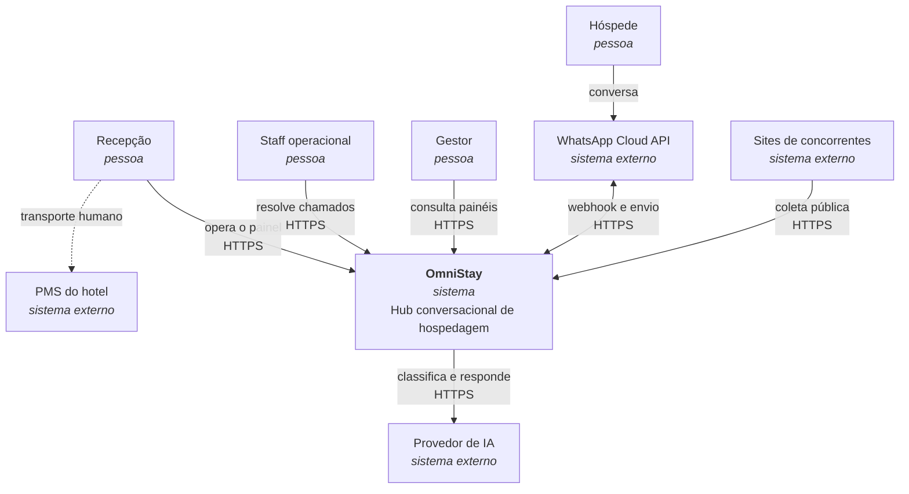
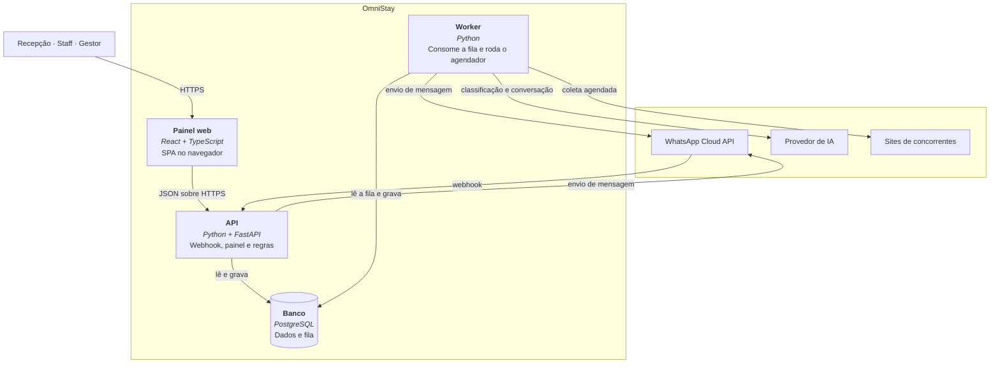
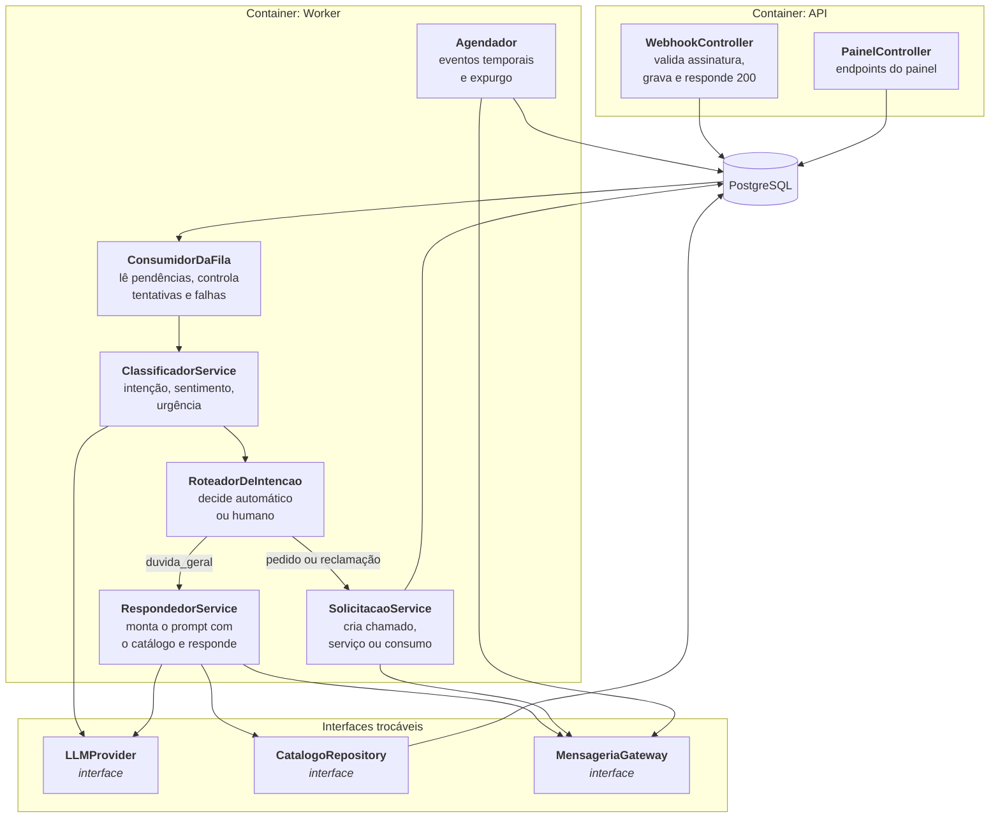
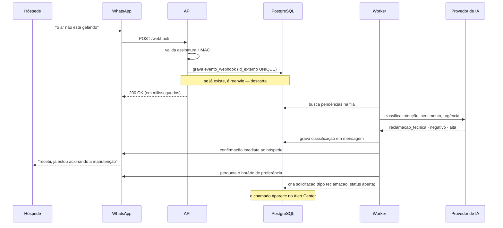

# OmniStay — Artefato 5: Arquitetura e Stack

**Projeto:** OmniStay — Hub Conversacional para Hotelaria
**Aluno:** Thiago Alves Feitosa — Sistemas de Informação (FIAP)
**Versão:** 1.0 — 07/08/2026
**Status:** em elaboração

---

## 1. Restrições de projeto

Arquitetura é a arte de escolher dentro de restrições. Estas são as deste projeto, e elas
explicam praticamente toda decisão registrada adiante.

| Restrição | Consequência arquitetural |
| --- | --- |
| **Custo zero** durante desenvolvimento e apresentação | Nenhum serviço pago. Cada componente adicional precisa caber em camada gratuita, ou não entra |
| **Um único desenvolvedor** | Complexidade operacional é o recurso mais escasso. Cada serviço a manter compete com tempo de implementar |
| **Prazo acadêmico fixo** | O que não estiver pronto na data não existe. Arquitetura que exige muita infraestrutura antes da primeira funcionalidade é inviável |
| **Sem integração com o PMS** | Não há sistema externo a consumir. A fronteira é o WhatsApp, o provedor de IA e as fontes de mercado |
| **Número de teste da Meta** | Até 5 destinatários. Suficiente para validar, insuficiente para carga real |

> **Princípio adotado:** escolher sempre a opção com menos peças móveis que resolva o
> problema real. Complexidade só entra no projeto quando existe um problema concreto que a
> justifique — não em antecipação a um problema hipotético.

---

## 2. Estilo arquitetural

> **Decisão (07/08/2026):** **monolito modular**. Uma única aplicação implantável,
> organizada internamente em módulos com fronteiras explícitas.

### 2.1 Por que não microsserviços

A alternativa seria separar conversa, atendimento e inteligência de mercado em serviços
independentes. Foi descartada por três motivos concretos:

- **Não há problema de escala a resolver.** Microsserviços existem para permitir que times
  diferentes evoluam e implantem partes diferentes de forma independente, e para escalar
  componentes separadamente. Aqui há um desenvolvedor e um volume de 500 hóspedes por mês.
- **O custo operacional seria proibitivo.** Cada serviço precisa de hospedagem, monitoramento
  e comunicação entre eles. Em camada gratuita, isso multiplica os pontos de falha.
- **A fronteira entre os domínios ainda não está estável.** Separar cedo demais é o erro
  clássico: erra-se o corte e paga-se o preço de uma chamada de rede onde bastaria uma
  chamada de função.

### 2.2 Por que **modular**, e não apenas monolito

O adjetivo importa. Os módulos têm fronteiras declaradas e se comunicam por interfaces, não
por acesso direto ao banco uns dos outros. Isso preserva a opção de extrair um módulo mais
tarde, se algum dia houver motivo — sem pagar hoje o custo de tê-los separados.

O caso mais provável de extração futura é o **Market Intel**: ele já roda por agendamento, em
paralelo, sem tocar o fluxo do hóspede, e depende de bibliotecas de coleta que o resto do
sistema não usa. É o candidato natural, e a modularização deixa essa porta aberta.

---

## 3. Visão C4 — nível 1: contexto

Quem interage com o sistema e com que finalidade. É a mesma fronteira do Artefato 3,
reapresentada na notação de arquitetura.




**O hóspede não fala com o sistema — fala com o WhatsApp.** Essa distinção é arquitetural:
o OmniStay nunca controla a experiência do canal, e toda restrição da Meta (janela de 24h,
templates aprovados, categorias de cobrança) é restrição do sistema.

---

## 4. Visão C4 — nível 2: containers

O que roda como processo separado, e como as peças se comunicam.




### 4.1 Quatro containers, e a razão de cada um

| Container | Tecnologia | Responsabilidade | Por que separado |
| --- | --- | --- | --- |
| **Painel web** | React + TypeScript | Interface de recepção, staff e gestão | Já existe no protótipo. Roda no navegador do usuário, não no servidor |
| **API** | Python + FastAPI | Recebe o webhook, serve o painel, aplica regras | Precisa responder rápido e sempre. Nunca faz trabalho demorado |
| **Worker** | Python | Consome a fila, chama a IA, envia mensagens, roda o agendador | O trabalho lento não pode bloquear a API |
| **Banco** | PostgreSQL | Dados e **também a fila** | Um só lugar durável, sem serviço adicional |

> **Decisão (07/08/2026):** o **worker e o agendador são o mesmo processo** no MVP. São
> duas responsabilidades distintas, mas ambas de baixa frequência, e separá-las custaria
> mais um processo para hospedar e monitorar. A separação fica registrada como evolução, com
> gatilho explícito: quando o volume da fila fizer o agendamento atrasar.

**A regra que governa a divisão API/Worker:** a API nunca faz nada que possa demorar. Se uma
operação depende de rede externa ou de IA, ela vira uma linha na fila. Isso é o que garante
que o webhook responda dentro do prazo da Meta — ver seção 7.

---

## 5. Visão C4 — nível 3: componentes do módulo de conversa

Detalhamento apenas deste módulo, que concentra a complexidade real do sistema. Os demais
são operações de cadastro e consulta que um diagrama de componentes não esclareceria.




### 5.1 As três interfaces trocáveis

O sistema tem exatamente três pontos onde depende de algo que pode mudar. Todos ficam atrás
de interface, e nenhum é chamado diretamente pelo domínio.

| Interface | Implementação no MVP | Por que trocável |
| --- | --- | --- |
| `LLMProvider` | Modelo classe Flash em camada gratuita | Provedores de IA mudam de preço, de limite e de qualidade. Trocar não pode significar reescrever o domínio |
| `CatalogoRepository` | Catálogo inteiro carregado do banco | Quando o catálogo crescer, vira busca. A decisão está isolada em um lugar só |
| `MensageriaGateway` | WhatsApp Cloud API | Permite a implementação falsa usada em teste e no simulador da apresentação |

**A terceira é a que salva a demonstração.** Com `MensageriaGateway` atrás de interface, o
simulador do protótipo é apenas outra implementação — o mesmo domínio roda contra o WhatsApp
real ou contra a tela de simulação, sem nenhuma condicional espalhada pelo código.

O mesmo vale para os testes: um `LLMProvider` falso devolve classificações determinísticas,
o que permite testar o roteamento sem depender de rede nem gastar cota.

---

## 6. Organização do código

### 6.1 Módulos

| Módulo | Responsabilidade | Tabelas que governa |
| --- | --- | --- |
| `propriedade` | Hotel, usuários, parâmetros, catálogo | `hotel`, `usuario`, `parametro_hotel`, `catalogo_item` |
| `hospedagem` | Reservas, hóspedes, ciclo de vida, consentimento | `reserva`, `hospede`, `reserva_hospede`, `consentimento` |
| `conversa` | Webhook, classificação, resposta automática | `mensagem`, `evento_webhook` |
| `atendimento` | Chamados, serviços e consumos faturáveis | `solicitacao`, `consumo` |
| `feedback` | Pulso e pesquisa de checkout | `avaliacao` |
| `mercado` | Coleta e consolidação de preços | `concorrente`, `coleta_mercado` |

**Regra de fronteira:** um módulo só lê e grava nas tabelas que governa. Precisando de dado
de outro, chama o serviço daquele módulo — nunca a tabela diretamente. É essa disciplina que
torna o monolito modular, e não apenas grande.

### 6.2 Camadas dentro de cada módulo

```
router      →  entrada HTTP. Valida formato, converte, delega. Sem regra de negócio
service     →  a regra de negócio. Não conhece HTTP nem SQL
repository  →  acesso ao banco. Não conhece regra de negócio
schema      →  contratos de entrada e saída (Pydantic)
model       →  mapeamento das tabelas (SQLAlchemy)
```

A regra que mantém isso honesto: **`service` não importa nada de `router` nem escreve SQL.**
Quando um serviço precisa de dado, pede ao repositório. É o que permite testar a regra de
negócio sem subir servidor nem banco.

### 6.3 Estrutura de pastas

```
omnistay/
├── app/
│   ├── main.py                  ponto de entrada da API
│   ├── config.py                configuração por variável de ambiente
│   ├── database.py              sessão e conexão
│   ├── modulos/
│   │   ├── propriedade/         router · service · repository · schema · model
│   │   ├── hospedagem/
│   │   ├── conversa/
│   │   ├── atendimento/
│   │   ├── feedback/
│   │   └── mercado/
│   ├── portas/                  as três interfaces trocáveis
│   │   ├── llm_provider.py
│   │   ├── catalogo_repository.py
│   │   └── mensageria_gateway.py
│   ├── adaptadores/             implementações concretas das interfaces
│   │   ├── llm_flash.py
│   │   ├── llm_falso.py         usado em teste
│   │   ├── whatsapp_cloud.py
│   │   └── mensageria_simulada.py   usado no simulador da apresentação
│   ├── fila/                    enfileiramento e consumo
│   └── comum/                   log, erros, segurança, utilitários
├── worker/
│   ├── consumidor.py            consome a fila
│   └── agendador.py             eventos temporais e expurgo
├── frontend/                    React + TypeScript (protótipo existente)
├── migracoes/                   versionamento do esquema (Alembic)
├── testes/
│   ├── unitarios/
│   ├── integracao/
│   └── ponta_a_ponta/
├── 04-schema.sql                DDL de referência do Artefato 4
└── .env.example                 nomes das variáveis, nunca os valores
```

A separação entre `portas/` e `adaptadores/` é deliberada: as interfaces pertencem ao
domínio, as implementações pertencem à infraestrutura. Trocar de provedor de IA significa
acrescentar um arquivo em `adaptadores/` e mudar uma linha de configuração.

---

## 7. O caminho de uma mensagem

A sequência completa, do momento em que a Marina digita até a resposta chegar.



### 7.1 As três garantias do desenho

**A API responde em milissegundos.** Ela grava e devolve `200`. Nenhuma chamada de IA,
nenhum envio de mensagem, nenhuma consulta demorada acontece antes da resposta. É isso que
impede a Meta de considerar o webhook indisponível e reenviar em cascata.

**A confirmação ao hóspede vem antes da tramitação.** O passo de confirmar o recebimento
ocorre imediatamente após a classificação, e antes de criar o chamado. É a decisão da fase
F3b do Artefato 2 materializada na ordem das operações — não é detalhe de implementação, é
requisito.

**Nada se perde se o worker cair.** A mensagem já está gravada quando o processamento
começa. Um worker que morre no meio deixa a linha na fila, e a próxima execução a retoma.

---

## 8. Fila, idempotência e falhas

### 8.1 A fila vive no banco

> **Decisão (07/08/2026):** fila implementada como tabela no PostgreSQL, consumida por um
> worker. Alternativas descartadas: `BackgroundTasks` do FastAPI, por manter a tarefa em
> memória — um reinício perde a mensagem do hóspede sem deixar rastro; e Celery com Redis,
> por exigir um serviço adicional para hospedar e manter, em um projeto de custo zero e um
> desenvolvedor.

O consumo usa `SELECT ... FOR UPDATE SKIP LOCKED`, recurso nativo do PostgreSQL que permite
a vários workers lerem a mesma fila sem processar a mesma linha duas vezes. No MVP há um
worker só, mas o mecanismo já está correto para quando houver dois.

Campos de controle da fila, além do payload:

| Campo | Função |
| --- | --- |
| `status` | `pendente`, `processando`, `concluido`, `falha` |
| `tentativas` | Contador, para desistir depois de N |
| `proxima_tentativa_em` | Espera crescente entre falhas |
| `erro_ultima_tentativa` | Diagnóstico, sem conteúdo pessoal |

### 8.2 Reenvios do WhatsApp

A Meta reenvia a notificação quando não recebe confirmação de processamento. **O mesmo
evento chega duas ou três vezes**, e sem tratamento a Marina receberia respostas duplicadas.

A proteção é a restrição `UNIQUE` em `evento_webhook.id_externo`, criada no Artefato 4:
a segunda inserção falha, e o reenvio é descartado sem efeito colateral. Não depende de
lógica de aplicação correta — depende do banco, que é onde uma garantia dessas deve morar.

### 8.3 Tratamento de falhas

| Falha | Comportamento |
| --- | --- |
| Provedor de IA indisponível | A mensagem é gravada sem classificação e **escalada para o ramo humano**. Na dúvida, um humano vê |
| Envio de mensagem falha | Nova tentativa com espera crescente. Após N tentativas, `mensagem.status_envio = 'falha'` e sinalização no painel |
| Worker cai no meio | A linha volta a `pendente` por expiração do bloqueio, e é reprocessada |
| Banco indisponível | A API devolve erro ao webhook. A Meta reenvia — que é exatamente o comportamento desejado |

**Os três padrões de falha do Artefato 3 §6.11 estão implementados aqui:** gravar antes de
enviar, na dúvida escalar para humano, e a fila como fonte da verdade.

### 8.4 Ordem de chegada

Duas mensagens seguidas do mesmo hóspede podem chegar fora de ordem. Para classificação isso
é irrelevante — cada mensagem é classificada isoladamente. Para uma conversa com contexto,
importaria.

> **Decisão (07/08/2026):** o MVP **não garante ordem**. As mensagens carregam o timestamp de
> origem, e a conversa é reconstruída por ele na exibição. Implementar ordenação estrita
> exigiria fila por conversa, complexidade sem problema correspondente no volume atual.

---

## 9. Agendamento

Quatro tarefas periódicas, todas rodando no processo worker via `APScheduler`.

| Tarefa | Frequência | O que faz |
| --- | --- | --- |
| `verificar_cadastros_pendentes` | A cada hora | Reenvio único e marcação de `sem_cadastro_previo`. Lê `horas_ate_reenvio` de `parametro_hotel` |
| `disparar_pulso` | Diária | Verifica estadias elegíveis, com a **dupla supressão** — mínimo de 24h restantes e nenhum chamado aberto |
| `coletar_mercado` | Conforme `periodicidade_coleta_mercado` | Coleta preços dos concorrentes ativos |
| `expurgar_por_retencao` | Diária | Apaga o que venceu o prazo — ver 9.1 |

**Nenhuma frequência está no código.** Todas leem `parametro_hotel`, que foi criado no
Artefato 4 justamente para isso.

### 9.1 O expurgo por retenção

O Artefato 4 declarou prazos de retenção e registrou como pendência que declarar sem
implementar é pior do que não declarar. A implementação é esta tarefa:

| Alvo | Regra |
| --- | --- |
| `mensagem.conteudo` e `evento_webhook.payload` | Anonimizados 12 meses após o checkout da reserva. A linha permanece, o conteúdo é substituído |
| `hospede` e dados de ficha | Apagados 5 anos após o checkout da última reserva vinculada |
| `avaliacao.comentario` | Anonimizado junto com as mensagens |

**Anonimizar em vez de apagar, no caso das mensagens.** Apagar a linha destruiria a
estatística de volume de atendimento, que não tem nada de pessoal. Substituir o conteúdo
preserva a métrica e elimina o dado — que é o objetivo da retenção.

O expurgo roda com log de auditoria: quantas linhas, de que tipo, em que data. Sem isso não
há como demonstrar cumprimento.

---

## 10. A camada de IA

### 10.1 Duas chamadas com propósitos diferentes

| Chamada | Entrada | Saída | Característica |
| --- | --- | --- | --- |
| **Classificação** | A mensagem do hóspede | JSON estruturado com intenção, sentimento e urgência | Curta, barata, com resposta em formato fixo |
| **Conversação** | Pergunta + catálogo da propriedade | Texto de resposta | Mais longa, só ocorre no ramo automático |

Separar as duas é o que permite classificar toda mensagem sem pagar o custo de gerar texto
para as que nem serão respondidas automaticamente.

**A classificação exige saída estruturada.** O prompt pede JSON com campos fixos, e a
resposta é validada antes de ser usada. Uma saída que não valide é tratada como falha de
classificação — e cai no ramo humano, conforme a regra da seção 8.3.

### 10.2 O catálogo no prompt

> **Decisão (07/08/2026):** o **catálogo da propriedade é enviado inteiro** no prompt de
> conversação, atrás da interface `CatalogoRepository`.
>
> Justificativa: o catálogo de uma propriedade — horários, cardápio, serviços, programação e
> regras — são algumas dezenas de itens curtos, que cabem folgadamente no contexto do modelo.
> Uma busca por palavras-chave introduziria um modo de falha que hoje não existe: o hóspede
> escreve "desjejum" onde o catálogo diz "café da manhã", a busca não encontra, e o sistema
> escala para humano sem necessidade. Paráfrase é a norma em conversa por WhatsApp, não a
> exceção.
>
> Alternativas descartadas: **busca full-text** (`tsvector`), pelo modo de falha acima; e
> **busca semântica com pgvector**, que resolveria a paráfrase mas exige extensão no banco,
> geração de embeddings e uma chamada adicional de modelo por pergunta — complexidade sem
> problema correspondente no volume atual.
>
> **Gatilho de revisão:** quando o catálogo de uma propriedade ultrapassar o que cabe
> confortavelmente no prompt, ou quando o número de propriedades tornar o custo por mensagem
> relevante, a decisão é reaberta. A troca custa uma implementação nova de
> `CatalogoRepository`, e nada mais.

### 10.3 O limite do que a IA pode afirmar

O prompt de conversação instrui explicitamente que **a resposta deve se basear apenas no
catálogo fornecido**, e que perguntas fora dele devem ser recusadas com encaminhamento à
recepção. A recusa dispara `chamado_aberto` — é a seta 3.2 → 3.4 do Artefato 3.

Isso não é garantia absoluta; modelos de linguagem podem desviar da instrução. Por isso a
mitigação é dupla: instrução no prompt **e** a taxonomia de intenção, que só roteia para o
ramo automático o que foi classificado como `duvida_geral`.

---

## 11. Segurança

### 11.1 O webhook é um endereço público

Qualquer pessoa na internet pode enviar uma requisição para o endpoint do webhook. Sem
verificação, seria possível injetar mensagens falsas e disparar respostas do sistema.

| Proteção | Implementação |
| --- | --- |
| **Verificação de assinatura** | A Meta assina cada requisição no cabeçalho `X-Hub-Signature-256`, com HMAC SHA-256 sobre o corpo, usando o *app secret*. A API recalcula e compara **antes de processar qualquer coisa** |
| **Verificação de posse** | O `GET` de registro do webhook responde ao desafio da Meta com o token de verificação configurado |
| **Comparação em tempo constante** | A comparação da assinatura usa `hmac.compare_digest`, não `==`, para não vazar informação por tempo de resposta |
| **Limite de taxa** | Restrição por origem, para conter tentativa de sobrecarga |

**A verificação de assinatura é o item de segurança mais frequentemente esquecido em
integrações de webhook**, e o mais fácil de a banca perguntar. Ela é obrigatória, não
opcional.

### 11.2 Acesso ao painel

| Perfil | Acesso | Sessão |
| --- | --- | --- |
| `recepcao` | Reservas, fichas, confirmações de fase, fila do dia | Padrão |
| `staff` | Apenas o Alert Center e as solicitações atribuídas | **Longa, por dispositivo** |
| `gestor` | Painéis de mercado, satisfação e chamados. Somente leitura | Padrão |

> **Decisão (07/08/2026):** o perfil `staff` usa **sessão longa vinculada ao dispositivo**,
> sem exigir autenticação a cada chamado. Justificativa registrada no Artefato 2 §5.1: um
> profissional de manutenção com as mãos ocupadas não digita e-mail e senha em navegador de
> celular. Se o acesso for trabalhoso, ele resolve o problema e não marca como resolvido — e
> o hóspede nunca recebe a confirmação.
>
> **Contrapartida aceita:** um dispositivo perdido mantém acesso até a revogação. Mitigação:
> o perfil `staff` só enxerga chamados, nunca dados cadastrais de hóspede, e a sessão é
> revogável pelo painel da recepção.

**Como a sessão existe (F0.3, ajuste F8.1):** token opaco de 32 bytes no cookie
`omnistay_sessao` (`HttpOnly`, `SameSite=Strict`; `Secure` **somente** quando o pedido é
HTTPS — em HTTP local o navegador descarta cookie `Secure` e o login parece “não entrar”
com a suíte verde). O banco guarda apenas o SHA-256 do token na tabela `sessao`. JWT foi
rejeitado porque não é revogável sem lista de revogados — e a revogação precisa valer na
requisição seguinte. As durações por perfil vivem em `parametro_hotel`
(`duracao_sessao_*_horas`). O painel da F8.1 consome essas rotas; a SPA vive em `/app`
(não em `/`, para não colidir com `GET /fila-do-dia`).

Senhas armazenadas apenas como hash, com algoritmo de derivação lenta
(PBKDF2-HMAC-SHA256). O valor gravado carrega algoritmo, iterações e sal na própria linha.
A coluna `usuario.senha_hash` do Artefato 4 já registra isso como dado sensível.

### 11.3 Segredos e configuração

Configuração por **variável de ambiente**, nunca em código versionado. O repositório contém
`.env.example` com os nomes das variáveis e nenhum valor.

| Segredo | Uso |
| --- | --- |
| `WHATSAPP_APP_SECRET` | Verificação da assinatura do webhook |
| `WHATSAPP_TOKEN` | Envio de mensagens |
| `WHATSAPP_VERIFY_TOKEN` | Registro do webhook |
| `LLM_API_KEY` | Provedor de IA |
| `DATABASE_URL` | Conexão com o banco |
| `BOOTSTRAP_SENHA_INICIAL` | Senha do gestor criado pelo comando de bootstrap (uma vez) |
| `SENHA_ITERACOES` | Custo da derivação PBKDF2 (padrão 600000) |

> **Correção (12/08/2026):** `JWT_SECRET` foi removido. Com token opaco não há o que assinar,
> e JWT não atenderia à revogação imediata exigida no §11.2.

### 11.4 Dado pessoal em log

**O conteúdo das mensagens nunca é registrado em log.** Logs costumam ir para serviços de
terceiros, ter retenção própria e ser lidos por quem não precisaria ver aquilo — e o
conteúdo é classificado como DPC no dicionário do Artefato 4.

Os logs registram identificadores e resultados: `id_reserva`, intenção classificada, tempo de
processamento, código de erro. Nunca o texto.

---

## 12. Ambientes e implantação

> **Decisão (07/08/2026):** desenvolvimento e demonstração **em máquina local** por
> enquanto. A escolha de plataforma de hospedagem fica adiada até haver necessidade real de
> acesso externo contínuo.

### 12.1 Como o WhatsApp alcança uma máquina local

A Meta precisa entregar as notificações em um endereço público com HTTPS. Uma máquina
doméstica não tem. A solução para desenvolvimento é um **túnel** — um programa que cria um
endereço público temporário apontando para a porta local.

**Consequência operacional a registrar:** o endereço muda a cada reinício do túnel, e
precisa ser reconfigurado no painel da Meta. É aceitável em desenvolvimento e inconveniente
em demonstração.

**Para a banca isso não é problema**, porque a apresentação usa o simulador do protótipo —
que, pela arquitetura da seção 5.1, é apenas outra implementação de `MensageriaGateway`.
O sistema demonstrado é o mesmo, sem rede externa e sem risco de falha de conectividade
durante a defesa.

### 12.2 Opções de hospedagem avaliadas

Registro para quando a decisão for retomada. Levantamento de agosto de 2026 — camadas
gratuitas mudam com frequência e devem ser reconferidas antes de decidir.

| Opção | A favor | Contra |
| --- | --- | --- |
| **Render (aplicação) + Neon (banco)** | Camada gratuita real sem cartão; o Neon é permanente, com 500 MB e escala a zero | O serviço web hiberna após 15 min e leva de 30 a 50 s para acordar |
| **Supabase** | Banco, autenticação e storage no mesmo lugar, gratuito permanente | **Pausa o projeto após 7 dias de inatividade** — risco de estar pausado na véspera da apresentação |
| **Render sozinho** | Simplicidade de um provedor só | **O PostgreSQL gratuito expira em 30 dias**, com 14 de carência antes da exclusão dos dados |
| **Local com túnel** *(adotado)* | Custo zero absoluto, sem dependência de plataforma | Endereço público instável; nada acessível quando a máquina está desligada |

**A hibernação é o problema arquitetural, não o custo.** Um serviço que dorme após 15
minutos responde a primeira requisição em quase um minuto — o que estoura o prazo do webhook
e faria a Meta reenviar. A mitigação usual é um ping periódico para manter o processo
acordado, o que cabe nas 750 horas mensais da camada gratuita, mas precisa ser configurado
deliberadamente.

### 12.3 Migrações de esquema

Versionamento com **Alembic**. O `04-schema.sql` do Artefato 4 é a referência documental do
modelo; a fonte de verdade em execução são as migrações versionadas, aplicadas em ordem.

Manter os dois exige disciplina: toda mudança de modelo gera uma migração **e** atualiza o
artefato. Documento e banco divergentes é pior do que documento inexistente.

---

## 13. Observabilidade e testes

### 13.1 Log estruturado

Log em JSON, com correlação por `id_reserva` e por identificador de requisição. Permite
reconstruir o percurso completo de uma mensagem — do webhook à resposta — a partir de um
único identificador.

Níveis: `ERROR` para falha que exige ação, `WARNING` para degradação tratada (IA indisponível
com escalonamento para humano), `INFO` para transições de estado.

### 13.2 Estratégia de testes

| Camada | O que cobre | Ferramenta |
| --- | --- | --- |
| **Unitários** | Serviços de domínio, com dependências falsas. Roteamento de intenção, regra de supressão do pulso, transições de estado | `pytest` |
| **Integração** | Repositórios contra banco real de teste, restrições e a trigger de transição | `pytest` + banco descartável |
| **Ponta a ponta** | O caminho da seção 7 completo, com `LLMProvider` e `MensageriaGateway` falsos | `pytest` + cliente de teste do FastAPI |

**O `LLMProvider` falso é o que torna o teste possível.** Ele devolve classificações fixas,
o que permite verificar que uma reclamação técnica com sentimento negativo gera chamado —
sem depender de rede, sem gastar cota e sem variação entre execuções.

**Casos que precisam de teste explícito**, porque são as decisões deste projeto:

- Reenvio do mesmo webhook não gera resposta duplicada
- Falha do provedor de IA escala para humano em vez de perder a mensagem
- Pulso não dispara com chamado aberto nem com menos de 24h de estadia
- Transição de estado inválida é rejeitada pelo banco, não só pela aplicação
- Consumo faturável nasce com `status_lancamento = 'pendente'`

---

## 14. Registros de decisão arquitetural (ADR)

Cada decisão estruturante com o contexto que a motivou, as alternativas consideradas e as
consequências aceitas. É o formato que responde à pergunta de banca antes que ela seja feita:
*"por que não a outra opção?"*

### ADR-001 — Não integrar ao PMS

**Contexto.** O hotel já opera um PMS que contém reservas e conta do hóspede. Integrar
eliminaria digitação e permitiria a conta completa no checkout.

**Decisão.** Não integrar. O recepcionista é a ponte humana entre os dois sistemas.

**Alternativas.** Integração por API, quando o PMS oferecer; leitura de arquivo exportado.

**Consequências.** *Aceitas:* quatro travessias de fronteira dependem de ação humana, três
delas com falha silenciosa; a lista do checkout é parcial. *Ganhas:* o hotel adota sem trocar
nem reconfigurar o sistema que usa, o que reduz o atrito de venda a praticamente zero — e é o
argumento comercial central do produto.

### ADR-002 — Monolito modular

**Contexto.** Um desenvolvedor, prazo acadêmico, custo zero, domínio pequeno.

**Decisão.** Aplicação única com módulos de fronteira explícita.

**Alternativas.** Microsserviços por domínio; monolito sem modularização.

**Consequências.** *Aceitas:* tudo escala junto; disciplina de fronteira depende de
convenção, não de barreira física. *Ganhas:* um artefato para implantar e monitorar; extração
futura preservada — o Market Intel é o candidato natural.

### ADR-003 — Fila no PostgreSQL

**Contexto.** O webhook precisa responder em segundos, mas a classificação por IA demora.
A mensagem não pode se perder.

**Decisão.** Fila como tabela, consumida por worker com `FOR UPDATE SKIP LOCKED`.

**Alternativas.** `BackgroundTasks` do FastAPI; Celery com Redis.

**Consequências.** *Aceitas:* menos vazão que uma fila dedicada; o banco acumula uma
responsabilidade adicional. *Ganhas:* durabilidade sem serviço novo; um reinício não perde
mensagem de hóspede; reaproveita infraestrutura que já existe.

### ADR-004 — Idempotência por restrição de banco

**Contexto.** A Meta reenvia notificações não confirmadas. O mesmo evento chega mais de uma
vez.

**Decisão.** `UNIQUE` em `evento_webhook.id_externo`. A segunda inserção falha e o reenvio é
descartado.

**Alternativas.** Verificação prévia em código; cache com expiração.

**Consequências.** *Aceitas:* a tabela cresce e precisa de expurgo. *Ganhas:* a garantia mora
no banco, não em lógica de aplicação que pode ter defeito ou condição de corrida.

### ADR-005 — Catálogo inteiro no prompt

**Contexto.** A resposta automática precisa se limitar aos fatos da propriedade. O catálogo
de um hotel são algumas dezenas de itens curtos.

**Decisão.** Enviar o catálogo completo no prompt, atrás de `CatalogoRepository`.

**Alternativas.** Busca full-text com `tsvector`; busca semântica com pgvector.

**Consequências.** *Aceitas:* o custo por mensagem cresce com o catálogo; não escala para
muitas propriedades com catálogos grandes. *Ganhas:* elimina a falha por paráfrase — que é a
norma em conversa de WhatsApp, não a exceção; zero infraestrutura adicional. *Gatilho de
revisão:* catálogo que não caiba confortavelmente no prompt.

### ADR-006 — Interfaces trocáveis para IA, catálogo e mensageria

**Contexto.** Provedores de IA mudam de preço e de limite. A apresentação usa simulador, não
o WhatsApp real.

**Decisão.** Três portas — `LLMProvider`, `CatalogoRepository`, `MensageriaGateway` — com
adaptadores intercambiáveis.

**Alternativas.** Chamar as bibliotecas diretamente do domínio.

**Consequências.** *Aceitas:* uma camada a mais de indireção. *Ganhas:* o simulador da banca
é um adaptador, não um caminho alternativo no código; testes determinísticos sem rede;
trocar de provedor não toca o domínio.

### ADR-007 — Multi-tenant desde o MVP

**Contexto.** O produto é B2B2C e a proposta é vender para várias propriedades.

**Decisão.** `id_hotel` presente nas tabelas de domínio desde a primeira versão.

**Alternativas.** Introduzir o particionamento quando surgir a segunda propriedade.

**Consequências.** *Aceitas:* uma coluna e um índice a mais em tabelas que hoje têm uma
única linha em `hotel`. *Ganhas:* evita uma migração que tocaria toda tabela e toda consulta,
exatamente no momento em que houvesse um cliente pagante em produção.

### ADR-008 — Execução local com túnel, hospedagem adiada

**Contexto.** Custo zero é requisito. As camadas gratuitas têm armadilhas: banco que expira
em 30 dias, projeto que pausa após 7 dias sem uso, serviço que hiberna em 15 minutos.

**Decisão.** Desenvolver e demonstrar localmente. Túnel para testar com o WhatsApp real.
Escolha de plataforma adiada.

**Alternativas.** Render com Neon; Supabase; Render sozinho.

**Consequências.** *Aceitas:* endereço público instável; nada acessível com a máquina
desligada. *Ganhas:* nenhuma dependência de plataforma no dia da defesa, e nenhum risco de
banco expirado ou projeto pausado na véspera.

**Revisão programada.** A decisão é deliberadamente provisória: vale para esta entrega, com
o objetivo de reduzir ao mínimo as peças móveis enquanto o sistema é construído. **A
implantação em nuvem é retomada na próxima entrega**, quando o sistema estiver funcionando
localmente e a escolha de plataforma puder ser feita contra um sistema real, e não contra
uma previsão. As três opções avaliadas em §12.2 ficam registradas para esse momento — com a
ressalva de que camadas gratuitas mudam e precisam ser reconferidas.

---

## 15. Riscos e limitações

| # | Risco | Probabilidade | Impacto | Mitigação |
| --- | --- | --- | --- | --- |
| 1 | Recepcionista não confirma check-in ou checkout | Alta | Alto — falha silenciosa | Detecção de divergência na `vw_fila_do_dia`; inferência por mensagem de hóspede não confirmado; confirmação em lote |
| 2 | Consumo faturável não é lançado no PMS | Alta | Alto — prejuízo financeiro | `status_lancamento` pendente e fila de pendências na passagem de turno |
| 3 | Provedor de IA muda limite ou indisponibiliza a camada gratuita | Média | Médio | `LLMProvider` trocável; degradação para ramo humano |
| 4 | Coleta de mercado bloqueada pela fonte | Média | Baixo | Ver 15.1 |
| 5 | Número de teste limitado a 5 destinatários | Certa | Baixo no MVP | Simulador para demonstração; limite é da validação, não do produto |
| 6 | Classificação da IA erra e roteia mal | Média | Médio | `classificacao_bruta` em JSONB para auditoria; `id_mensagem_origem` na solicitação; na dúvida escala para humano |
| 7 | Prazo acadêmico | Média | Alto | Módulos com fronteira permitem entregar P1 a P4 completos e P5 reduzido, se necessário |

### 15.1 Limites éticos e legais da coleta de mercado

O processo P5 coleta preços e avaliações de sites de terceiros. Isso exige registro explícito,
e é ponto que a banca costuma cobrar.

| Princípio | Aplicação |
| --- | --- |
| **Respeitar `robots.txt`** | O coletor lê e obedece as diretivas da fonte antes de acessar |
| **Somente dado público** | Apenas o que é exibido sem autenticação. Nada atrás de login |
| **Sem dado pessoal** | Coletam-se preço e nota agregada. **Nunca** nome ou texto de avaliador individual |
| **Frequência moderada** | Intervalo entre requisições e periodicidade baixa. O objetivo é acompanhar tarifa, não espelhar o site |
| **Identificação honesta** | *User-agent* identificável, sem se disfarçar de navegador comum |
| **Termos de uso** | Alguns sites proíbem coleta automatizada em contrato. Onde houver proibição expressa, a fonte não entra na lista |

> **Consequência aceita:** essa postura reduz o número de fontes viáveis e a frequência da
> coleta. É o preço de um produto comercializável — um sistema vendido a hotéis não pode
> operar sobre coleta que viola termos de uso das fontes.

### 15.2 O que esta arquitetura não resolve

Registro honesto, para não ser descoberto em banca:

- **Não há alta disponibilidade.** Um processo, um banco. Queda significa indisponibilidade.
- **Não há garantia de ordem** entre mensagens do mesmo hóspede (§8.4).
- **Não há auditoria genérica** de alteração de dados — decisão do Artefato 4 §8.3.
- **A dependência do clique humano permanece.** As mitigações tornam a omissão visível; não a
  eliminam. Só integração eliminaria, e ela foi descartada por decisão de produto.

---

## 16. Pendências abertas

Resolvidas por este artefato:

- [x] ~~Idempotência dos webhooks~~ Restrição `UNIQUE`, fluxo descrito em §8.2
- [x] ~~Ordem de chegada das mensagens~~ Não garantida no MVP, com justificativa (§8.4)
- [x] ~~Mecanismo de agendamento~~ `APScheduler` no worker, parâmetros em `parametro_hotel` (§9)
- [x] ~~Onde vive D7 e como é consultado~~ Catálogo inteiro no prompt, ADR-005
- [x] ~~Rotina de expurgo por retenção~~ Tarefa agendada com anonimização e auditoria (§9.1)
- [x] ~~Mecanismo de acesso do staff ao Alert Center~~ Sessão longa por dispositivo (§11.2)

Ainda abertas:

- [ ] Executar o `04-schema.sql` em um PostgreSQL real
- [ ] Definir os valores dos parâmetros com o hotel
- [ ] Cadastrar a lista de concorrentes e verificar os termos de uso de cada fonte
- [ ] Confirmar a lista oficial vigente de campos exigidos por lei para registro de hóspede
- [ ] Testar colagem no PMS real
- [ ] Confirmar junto à Meta a categoria do template de pulso do segundo dia
- [ ] Redigir a pergunta de opt-in da pesquisa de checkout
- [ ] Reconferir as camadas gratuitas antes de escolher a hospedagem, se ela for retomada
- [ ] Validar as personas com um recepcionista real, se houver acesso durante o projeto
- [ ] Material do MVP de usuário, ainda não enviado

---

## Próximo artefato

| # | Artefato | O que este documento entrega a ele |
| --- | --- | --- |
| 6 | Business Model Canvas — revisão completa | O custo real de operação (zero em desenvolvimento, e o que muda em produção), a estrutura multi-tenant que sustenta a venda a múltiplas propriedades, e os limites do produto registrados em §15.2 — que precisam ser refletidos na proposta de valor, sob pena de o Canvas prometer o que a arquitetura não entrega |
